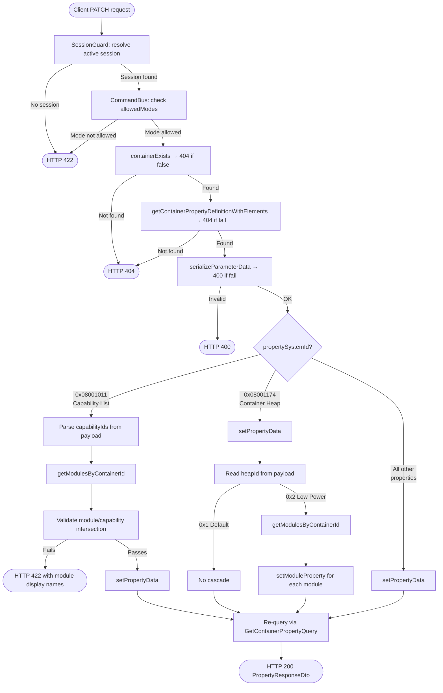

<!--
  Copyright (c) Qualcomm Technologies, Inc. and/or its subsidiaries.
  SPDX-License-Identifier: BSD-3-Clause
-->

# Set Container Property Data — Low-Level Design

## Table of Contents

- [Requirements](#requirements)
- [Section 1: Architecture & Call Flow](#section-1-architecture--call-flow)
  - [1.1 High-Level Workflow Diagram](#11-high-level-workflow-diagram)
  - [1.2 File and Folder Organization](#12-file-and-folder-organization)
  - [1.3 Layer Responsibilities](#13-layer-responsibilities)
- [Section 2: Presentation Layer](#section-2-presentation-layer)
- [Section 3: Core Layer](#section-3-core-layer)
  - [3.1 UpdateContainerPropertyCommand](#31-updatecontainerpropertycommand)
  - [3.2 UpdateContainerPropertyHandler](#32-updatecontainerpropertyhandler)
  - [3.3 ContainerPropertyDefQueryService Port Extension](#33-containerpropertydefqueryservice-port-extension)
  - [3.4 ModuleRepository Port Extensions](#34-modulerepository-port-extensions)
- [Section 4: Infrastructure Layer](#section-4-infrastructure-layer)
  - [4.1 ModuleNodeOverlayFetcher Extensions](#41-modulenodeoverlayfetcher-extensions)
  - [4.2 ModuleRepository — New Methods](#42-modulerepository--new-methods)
  - [4.3 PendingChangeWriter Specs](#43-pendingchangewriter-specs)
- [Section 5: Testing Strategy](#section-5-testing-strategy)

---

## Requirements

Requirements source: [../set-container-property-requirements.md](../set-container-property-requirements.md)

| ID | Requirement |
|---|---|
| FR-CP-01 | `PATCH /containers/:id/properties/:propSystemId` — accepts `elements: ParameterElementSummaryDto[]` |
| FR-CP-02 | Container not found → 404 |
| FR-CP-03 | Property definition not found → 404 |
| FR-CP-04 | Capability list (`0x08001011`) — validate module/capability intersection → 422 with failing module display names |
| FR-CP-05 | Container Heap (`0x08001174`) — Default: no cascade; Low Power: force all modules to Low Power |
| FR-CP-06 | Write must be staged; visible immediately via overlay read |
| FR-CP-07 | Handler returns void; controller re-queries via new `GetContainerPropertyQuery` (singular); returns single `PropertyResponseDto` → 200 |
| FR-CCR-01 | Active session required → 422 if none |
| FR-CCR-02 | All writes staged until commit |
| FR-CCR-03 | Session overlay applied to reads immediately after write |

---

## Section 1: Architecture & Call Flow

The write path follows hexagonal + CQRS using a **Command + CommandBus + UnitOfWork**. The existing `UpdateContainerPropertyCommand` and `UpdateContainerPropertyHandler` stubs are implemented — no new command/handler files created.

The re-query after write uses a **new** `GetContainerPropertyQuery` (singular). The existing `getContainerProperty` controller stub is also implemented as part of this work.

### 1.1 High-Level Workflow Diagram



### 1.2 File and Folder Organization

Files annotated **(existing)** already exist; **(modified)** means an existing file is changed; **(new)** means a new file.

#### Presentation Layer
```
packages/api/src/presentation/rest/modules/container/
└── container.controller.ts                                             (modified — implement updateContainerProperty + getContainerProperty stubs)
```

#### Core Layer
```
packages/core/src/application/
├── ports/persistence/repositories/
│   └── module/
│       └── module.repository.ts                                       (modified — add getModulesByContainerId, updateHeapId)
├── ports/persistence/query-services/
│   └── container-property-definition/
│       └── container-property-def-query-service.ts                    (modified — add getContainerPropertyDefinitionWithElements)
├── orchestration/cqrs/registries/
│   └── query-handler-registry.ts                                      (modified — register GetContainerPropertyHandler)
└── usecase-designer/container/
    ├── container-property-ids/
    │   └── container-property-ids.ts                                  (new — CONTAINER_HEAP_PROP_ID, CONTAINER_CAPABILITY_PROP_ID, HEAP_ID_LOW_POWER)
    ├── patch-property/
    │   ├── patch-container-property.command.ts                        (modified — data: unknown[] → elements: ParameterElementSummaryDto[])
    │   └── patch-container-property.handler.ts                       (modified — implement logic)
    └── get-property/
        ├── get-container-property.query.ts                            (new)
        └── get-container-property.handler.ts                         (new)
```

#### Infrastructure Layer
```
packages/infrastructure/persistence/src/persistence-typeorm-sqllite/
├── entity-schema/usecase-data/module/
│   └── spf-module.schema.ts                                           (modified — add heapId column)
├── fetchers/
│   ├── module-node-overlay-fetcher.ts                                 (modified — refactor fetchOne to delegate to fetchModules; add fetchModules with filter options)
│   └── definitions/spf-module-definitions/
│       └── spf-module-definition-root-fetcher.ts                      (existing — used by getModulesByContainerId)
└── repositories/
    └── module/
        └── module.repository.ts                                       (modified — implement getModulesByContainerId, updateHeapId)
```

**Schema change:** `heapId` added as a direct column on `spf_modules`. Migration must be regenerated.

### 1.3 Layer Responsibilities

```
Presentation (API)
  updateContainerProperty:
    → @UseGuards(SessionGuard) — no session → HTTP 422
    → builds UpdateContainerPropertyCommand(containerSystemId, propSystemId, dto.elements)
    → CommandBus.execute(command, session)
    → re-queries via GetContainerPropertyQuery → returns single PropertyResponseDto

  getContainerProperty (stub — also implemented here):
    → builds GetContainerPropertyQuery(projectId, containerSystemId, propertySystemId)
    → QueryBus.execute(query) → returns single PropertyResponseDto

Core (Application)
  UpdateContainerPropertyHandler:
    fileSystemId = uow.getWriteContext().session.fileSystemId

    Read phase:
      1. containerExists(containerSystemId, fileSystemId) → 404 if false
      2. getContainerPropertyDefinitionWithElements(propertySystemId, fileSystemId) → 404 if fail
      3. serializeParameterData(propDef.elementsStructure, command.elements) → 400 if fail

    Special cases (before write):
      4. If 0x08001011:
           parse capabilityIds from payload (count + N × uint32)
           getModulesByContainerId(containerSystemId, fileSystemId)
           validateModuleCapabilityIntersection → 422 if any module fails

    Write phase (transactional — steps 5 and 6 together):
      uow.startTransaction()
      try:
        5. ContainerRepository.setPropertyData (existing method)
        6. If 0x08001174:
               read heapId from payload (first uint32)
               if heapId = 0x2 (Low Power):
                 getModulesByContainerId(containerSystemId, fileSystemId)
                 updateHeapId(module.moduleSystemId, heapId) for each module
        uow.commit()
      catch:
        if uow.isInTransaction() → uow.rollback()
        throw

Infrastructure (Persistence)
  ModuleNodeOverlayFetcher.fetchModules (new — replaces fetchByContainerId):
    → accepts filter?: { moduleSystemId?: number; containerSystemId?: number }
    → Layer 1: query spf_modules WHERE fileSystemId = ? AND filter columns
      (containerSystemId filter uses existing index ix_spf_modules_container_file_system)
    → Layer 2: overlay via getByTable(sessionId, SpfModule)
      UPDATE/DELETE: actions whose aggregateId is in base systemId set
      CREATE: actions where newValue matches filter (e.g. containerSystemId)
    → applies OverlayMergeImpl + appends staged CREATEs
    → returns OverlaidSpfModule[]

  fetchOne refactored to delegate to fetchModules({ moduleSystemId }) and return first result.

  ModuleRepository.getModulesByContainerId:
    → delegates to fetchByContainerId → OverlaidSpfModule[]
    → collects unique definitionSystemIds from result
    → calls SpfModuleDefinitionRootFetcher.fetchOne(defSystemId, fileSystemId, sessionId) for each
      in parallel via Promise.all
    → maps to ModuleForContainer[] using displayName + containerTypeSystemIds from fetcher
    (overlay-aware for container type links — no ad-hoc queries needed)

  ModuleRepository.updateHeapId:
    → writeDelta with targetTable=SpfModule, targetSystemId=moduleSystemId,
      aggregateId=moduleSystemId, delta={ heapId }
```

---

## Section 2: Presentation Layer

**File:** `packages/api/src/presentation/rest/modules/container/container.controller.ts` (modified)

```typescript
@Patch('/:containerSystemId/properties/:propertySystemId')
@UseGuards(SessionGuard)
async updateContainerProperty(
  @Param('projectId') projectId: string,
  @Param('containerSystemId', ParseIntPipe) containerSystemId: number,
  @Param('propertySystemId', ParseIntPipe) propertySystemId: number,
  @Body() dto: UpdatePropertyRequestDto,
  @ArcSession() session: ActiveSession,
): Promise<ApiResult<PropertyResponseDto>> {
  await this.commandBus.execute(
    new UpdateContainerPropertyCommand(containerSystemId, propertySystemId, dto.elements),
    session,
  );
  const query = new GetContainerPropertyQuery(
    Number.parseInt(projectId, 10),
    containerSystemId,
    propertySystemId,
    'api-client',
  );
  // Handler returns Result<PropertyDataDto> (core internal read model).
  // mapPropertyToDto converts PropertyDataDto → PropertyDto (core shared zod DTO).
  // PropertyResponseDto is the NestJS/Swagger class wrapping the same shape via createZodDto.
  const result = await this.queryBus.execute<Result<PropertyDataDto>>(query);
  return toApiResult(result, data => mapPropertyToDto(data));
}

@Get('/:containerSystemId/properties/:propertySystemId')
async getContainerProperty(
  @Param('projectId', ParseIntPipe) projectId: number,
  @Param('containerSystemId', ParseIntPipe) containerSystemId: number,
  @Param('propertySystemId', ParseIntPipe) propertySystemId: number,
): Promise<ApiResult<PropertyResponseDto>> {
  const query = new GetContainerPropertyQuery(
    projectId,
    containerSystemId,
    propertySystemId,
    'api-client',
  );
  const result = await this.queryBus.execute<Result<PropertyDataDto>>(query);
  return toApiResult(result, data => mapPropertyToDto(data));
}
```

---

## Section 3: Core Layer

### 3.1 UpdateContainerPropertyCommand

**File:** `packages/core/src/application/usecase-designer/container/patch-property/patch-container-property.command.ts` (modified)

```typescript
export class UpdateContainerPropertyCommand extends BaseCommand {
  static override readonly requiresSession = true;
  static override readonly allowedModes: readonly SessionMode[] = [
    SESSION_MODE.Designer,
    SESSION_MODE.DiffMerge,
  ];

  constructor(
    public readonly containerSystemId: number,
    public readonly propertySystemId: number,
    public readonly elements: ParameterElementSummaryDto[],
  ) {
    super();
  }
}
```

### 3.2 UpdateContainerPropertyHandler

**File:** `packages/core/src/application/usecase-designer/container/patch-property/patch-container-property.handler.ts` (modified)

Property ID constants are defined in a dedicated file and imported:

```typescript
// packages/core/src/application/usecase-designer/container/container-property-ids/container-property-ids.ts (new)
export const CONTAINER_HEAP_PROP_ID       = 0x08001174;
export const CONTAINER_CAPABILITY_PROP_ID = 0x08001011;
export const HEAP_ID_LOW_POWER            = 0x2;
```

```typescript
export class UpdateContainerPropertyHandler
  implements CommandHandler<UpdateContainerPropertyCommand, Promise<void>> {

  constructor(private readonly uow: UnitOfWork) {}

  async handle(command: UpdateContainerPropertyCommand): Promise<void> {
    const {session} = this.uow.getWriteContext();
    const fileSystemId = session.fileSystemId;

    // Step 1: validate container exists
    const exists = await this.uow.getContainerRepository()
      .containerExists(command.containerSystemId, fileSystemId);
    if (!exists) {
      throw new ResourceNotFoundException(
        `Container ${command.containerSystemId} not found`,
      );
    }

    // Step 2: validate property definition exists + fetch elementsStructure
    const propDefResult = await this.uow.getQueryServices()
      .containerPropertyDefQueryService
      .getContainerPropertyDefinitionWithElements(command.propertySystemId, fileSystemId);
    if (propDefResult.kind === RESULT_KIND.Fail) {
      throw new ResourceNotFoundException(
        `Property definition ${command.propertySystemId} not found`,
      );
    }
    const propDef = propDefResult.data;

    // Step 3: serialize elements → Uint8Array
    const serialized = serializeParameterData(propDef.elementsStructure, command.elements);
    if (!serialized.ok) {
      throw new BadRequestException(serialized.error);
    }
    const payload = serialized.value;

    // Step 4: capability list — validate module/capability intersection before writing
    if (command.propertySystemId === CONTAINER_CAPABILITY_PROP_ID) {
      const reader = new BinaryDataReader(payload);
      const count = reader.readUInt32();
      const capabilityIds = Array.from({length: count}, () => reader.readUInt32());
      const modules = await this.uow.getModuleRepository()
        .getModulesByContainerId(command.containerSystemId, fileSystemId);
      validateModuleCapabilityIntersection(modules, capabilityIds);
      // throws DomainRuleViolationException listing failing module displayNames → HTTP 422
    }

    // Step 5 + 6: write container property and heap cascade — one transaction
    await this.uow.startTransaction();
    try {
      // Step 5: write container property
      await this.uow.getContainerRepository()
        .setPropertyData(command.containerSystemId, command.propertySystemId, payload);

      // Step 6: heap cascade — only fires for Low Power; Default leaves modules as-is
      if (command.propertySystemId === CONTAINER_HEAP_PROP_ID) {
        const heapId = new BinaryDataReader(payload).readUInt32();
        if (heapId === HEAP_ID_LOW_POWER) {
          const modules = await this.uow.getModuleRepository()
            .getModulesByContainerId(command.containerSystemId, fileSystemId);
          // Promise.all is safe here: all writes share the same QueryRunner (same connection,
          // same transaction). SQLite serialises the actual DB writes at the connection level,
          // so there is no deadlock risk. Promise.all eliminates per-call async overhead for
          // containers with many modules.
          await Promise.all(
            modules.map(mod =>
              this.uow.getModuleRepository().updateHeapId(mod.moduleSystemId, heapId),
            ),
          );
        }
      }

      await this.uow.commit();
    } catch (error) {
      if (this.uow.isInTransaction()) await this.uow.rollback();
      throw error;
    }
  }
}
```

**Internal helper functions:**

| Function | Purpose |
|---|---|
| `serializeParameterData(elementsStructure, elements)` | Converts `ParameterElementSummaryDto[]` → `Uint8Array`; validates type, range, alignment. Returns `{ ok, value/error }` |
| `BinaryDataReader(payload).readUInt32()` | Reads little-endian uint32 — existing shared utility at `packages/core/src/application/usecase-designer/shared/utils/binary-data-reader.ts`. Used for both capability ID parsing and heap ID extraction |
| `validateModuleCapabilityIntersection(modules, capIds)` | For each module checks `containerTypeIds ∩ capIds` is non-empty; throws `DomainRuleViolationException` listing failing `displayName`s |

### 3.3 ContainerPropertyDefQueryService Port Extension

**File:** `packages/core/src/application/ports/persistence/query-services/container-property-definition/container-property-def-query-service.ts` (modified)

```typescript
export interface ContainerPropertyDefQueryService {
  // ... existing methods ...

  // Returns a single container property definition including elementsStructure.
  // Result.fail if not found.
  getContainerPropertyDefinitionWithElements(
    propertySystemId: number,
    fileSystemId: number,
  ): Promise<Result<ContainerPropertyDefinitionWithElementsReadModel>>;
}
```

`ContainerPropertyDefinitionWithElementsReadModel` is already defined at:
`packages/core/src/application/ports/persistence/query-services/container-property-definition/container-property-definition-with-elements-read-model.ts`

It is a type alias for `PropertyDefinitionWithElements` which extends `PropertyDefinitionReadModel` with `elementsStructure: string`. No new type needed.

The infra implementation (`DbContainerPropertyDefQueryService`) delegates to the existing `ContainerPropertyDefinitionFetcher`, filtering by `systemId` and returning the single match.

### 3.4 ModuleRepository Port Extensions

**File:** `packages/core/src/application/ports/persistence/repositories/module/module.repository.ts` (modified)

```typescript
export interface ModuleForContainer {
  moduleSystemId: number;      // PK of SpfModule — used as aggregateId for updateHeapId
  containerTypeIds: number[];  // supported container type IDs — used for capability intersection check
  displayName: string;         // from SpfModuleDefinition — used in capability mismatch error message
}

export interface ModuleRepository {
  // ... existing methods ...

  // Returns all non-deleted modules belonging to a container.
  // Overlay-aware: excludes pending DELETE, includes pending CREATE.
  getModulesByContainerId(
    containerSystemId: number,
    fileSystemId: number,
  ): Promise<ModuleForContainer[]>;

  // Stages a heapId update on a SpfModule row via edit_actions.
  // aggregateId = moduleSystemId; targetTable = SpfModule.
  updateHeapId(
    moduleSystemId: number,
    heapId: number,
  ): Promise<void>;
}
```

---

### 3.5 GetContainerPropertyQuery and Handler (singular)

These are new files required by the re-query step in the write controller (FR-CP-07) and also implement the `getContainerProperty` GET stub.

**Files:**
- `packages/core/src/application/usecase-designer/container/get-property/get-container-property.query.ts` (new)
- `packages/core/src/application/usecase-designer/container/get-property/get-container-property.handler.ts` (new)

#### Query

```typescript
export class GetContainerPropertyQuery extends BaseQuery {
  public readonly projectId: number;
  public readonly containerSystemId: number;
  public readonly propertySystemId: number;

  constructor(
    projectId: number,
    containerSystemId: number,
    propertySystemId: number,
    clientId: string,
  ) {
    super(clientId);
    this.projectId = projectId;
    this.containerSystemId = containerSystemId;
    this.propertySystemId = propertySystemId;
  }
}
```

#### Handler

```typescript
export class GetContainerPropertyHandler
  implements QueryHandler<GetContainerPropertyQuery, Promise<Result<PropertyDataDto>>> {

  constructor(private readonly queryServices: QueryServices) {}

  async handle(query: GetContainerPropertyQuery): Promise<Result<PropertyDataDto>> {
    // Step 1: resolve fileSystemId
    const fileSystemId = await this.queryServices.projectQueryService
      .getFileIdByProjectId(query.projectId);

    // Step 2: container existence check + payload fetch (scoped to one property)
    const payloadsResult = await this.queryServices.containerQueryService
      .findPropertyPayloads(query.containerSystemId, fileSystemId);
    if (payloadsResult.kind === RESULT_KIND.Fail) {
      throw new Error(payloadsResult.issues[0]?.message ?? 'Failed to load container property');
    }
    if (payloadsResult.data === null) {
      throw new ResourceNotFoundException(
        `Container with systemId ${query.containerSystemId} not found`,
      );
    }

    // Step 3: find the specific property payload
    const payload = payloadsResult.data.find(
      p => p.propertySystemId === query.propertySystemId,
    );
    if (payload === undefined) {
      throw new ResourceNotFoundException(
        `Property ${query.propertySystemId} not found on container ${query.containerSystemId}`,
      );
    }

    // Step 4: fetch property definition with elementsStructure
    const defResult = await this.queryServices.containerPropertyDefQueryService
      .getContainerPropertyDefinitionWithElements(query.propertySystemId, fileSystemId);
    if (defResult.kind === RESULT_KIND.Fail) {
      throw new ResourceNotFoundException(
        `Property definition ${query.propertySystemId} not found`,
      );
    }
    const def = defResult.data;

    // Step 5: parse elements from binary payload
    const elements = payload.payload !== null
      ? parseParameterData(payload.payload, def.elementsStructure)
      : [];

    return Result.ok({
      systemId: payload.systemId,
      propertyId: def.propertyId,
      propertyName: def.name,
      elements,
    });
  }
}
```

**Error contract:**

| Condition | Behaviour |
|---|---|
| Container not found | throws `ResourceNotFoundException` → 404 |
| Property payload not found on container | throws `ResourceNotFoundException` → 404 |
| Property definition not found | throws `ResourceNotFoundException` → 404 |
| Success | `Result.ok(PropertyDataDto)` → 200 |

**Ports used** (all existing — no new ports):

| Port | Method | Already exists |
|---|---|---|
| `ProjectQueryService` | `getFileIdByProjectId` | ✅ |
| `ContainerQueryService` | `findPropertyPayloads` | ✅ (added by get-container-properties feature) |
| `ContainerPropertyDefQueryService` | `getContainerPropertyDefinitionWithElements` | ✅ (Section 3.3 of this doc) |

**Registration:** `GetContainerPropertyHandler` registered in `query-handler-registry.ts` (already noted in Section 1.2).

**Unit tests** — `get-container-property.handler.spec.ts` (new):

| Scenario | Expected outcome |
|---|---|
| Container not found | throws `ResourceNotFoundException` → 404 |
| Property payload not on container | throws `ResourceNotFoundException` → 404 |
| Property definition not found | throws `ResourceNotFoundException` → 404 |
| Success — payload present | returns `Result.ok(PropertyDataDto)` with parsed elements |
| Success — payload is null | returns `Result.ok(PropertyDataDto)` with `elements: []` |

---

## Section 4: Infrastructure Layer

### 4.1 ModuleNodeOverlayFetcher Extensions

**File:** `packages/infrastructure/persistence/src/persistence-typeorm-sqllite/fetchers/module-node-overlay-fetcher.ts` (modified)

`fetchModules` is a new unified method replacing `fetchByContainerId`. `fetchOne` is refactored to delegate to it. `OverlaidSpfModule` is unchanged — existing callers unaffected.

#### `fetchModules`

Unified overlay-aware module fetch with optional filter. Used by `getModulesByContainerId` (filter by `containerSystemId`) and by the refactored `fetchOne` (filter by `moduleSystemId`).

```typescript
export interface FetchModulesFilter {
  moduleSystemId?: number;
  containerSystemId?: number;
}

async fetchModules(
  fileSystemId: number,
  sessionId: number | null,
  filter?: FetchModulesFilter,
): Promise<OverlaidSpfModule[]> {
  // Layer 1: base rows
  const qb = this.manager
    .getRepository(ENTITY_NAMES.SpfModule)
    .createQueryBuilder('sm')
    .where('sm.fileSystemId = :fileSystemId', {fileSystemId});

  if (filter?.moduleSystemId !== undefined) {
    qb.andWhere('sm.systemId = :moduleSystemId', {moduleSystemId: filter.moduleSystemId});
  }
  if (filter?.containerSystemId !== undefined) {
    // uses existing index ix_spf_modules_container_file_system
    qb.andWhere('sm.containerSystemId = :containerSystemId', {containerSystemId: filter.containerSystemId});
  }

  const baseRows = await qb.getMany() as unknown as SpfModuleBase[];

  if (!sessionId) return baseRows.map(r => this.toOverlaid(r));

  // Layer 2: overlay
  const allActions = await this.editActionsSvc.getByTable(sessionId, ENTITY_NAMES.SpfModule);
  const baseIds = new Set(baseRows.map(r => r.systemId));

  const updateDeleteActions = allActions.filter(a => baseIds.has(a.aggregateId));
  const createActions = allActions.filter(a => {
    if (a.operation !== CHANGE_OPERATION.Create) return false;
    const v = a.newValue as Partial<SpfModuleBase>;
    if (filter?.containerSystemId !== undefined && v.containerSystemId !== filter.containerSystemId) return false;
    if (filter?.moduleSystemId !== undefined && a.targetSystemId !== filter.moduleSystemId) return false;
    return true;
  });

  const overlaid = this.overlay.applyToCollection(
    baseRows as unknown as Array<{systemId: number}>,
    updateDeleteActions,
  ).map(r => r.effective as unknown as SpfModuleBase);

  const created = createActions.map(a => {
    const payload = a.newValue as Partial<SpfModuleBase>;
    return {
      systemId: a.targetSystemId,
      instanceId: payload.instanceId ?? 0,
      alias: payload.alias ?? null,
      definitionSystemId: payload.definitionSystemId ?? 0,
      containerSystemId: payload.containerSystemId ?? 0,
      subgraphSystemId: payload.subgraphSystemId ?? 0,
      fileSystemId: payload.fileSystemId ?? fileSystemId,
      parentId: null,
    } as OverlaidSpfModule;
  });

  return [...overlaid.map(r => this.toOverlaid(r)), ...created];
}
```

`fetchOne` is refactored to delegate to `fetchModules`:

```typescript
async fetchOne(
  moduleSystemId: number,
  fileSystemId: number,
  sessionId: number | null,
): Promise<OverlaidSpfModule | null> {
  const results = await this.fetchModules(fileSystemId, sessionId, {moduleSystemId});
  return results[0] ?? null;
}
```

### 4.2 ModuleRepository — New Methods

**File:** `packages/infrastructure/persistence/src/persistence-typeorm-sqllite/repositories/module/module.repository.ts` (modified)

```typescript
async getModulesByContainerId(
  containerSystemId: number,
  fileSystemId: number,
): Promise<ModuleForContainer[]> {
  const {session} = this.uow.getWriteContext();
  const rows = await this.moduleNodeFetcher.fetchModules(
    fileSystemId,
    session.sessionId,
    {containerSystemId},
  );

  if (rows.length === 0) return [];

  const definitionSystemIds = [...new Set(rows.map(r => r.definitionSystemId))];

  // Use SpfModuleDefinitionRootFetcher for overlay-aware displayName + containerTypeSystemIds
  const defRoots = await Promise.all(
    definitionSystemIds.map(defId =>
      this.spfModuleDefinitionRootFetcher.fetchOne(defId, fileSystemId, session.sessionId),
    ),
  );

  const defMap = new Map(
    defRoots
      .filter((d): d is OverlaidDefinitionRoot => d !== null)
      .map(d => [d.systemId, d]),
  );

  return rows.map(r => {
    const def = defMap.get(r.definitionSystemId);
    return {
      moduleSystemId:   r.systemId,
      containerTypeIds: def?.containerTypeSystemIds ?? [],
      displayName:      def?.displayName ?? '',
    };
  });
}

async updateHeapId(
  moduleSystemId: number,
  heapId: number,
): Promise<void> {
  const {session, groupId} = this.uow.getWriteContext();

  await this.writer.writeDelta(
    {
      targetTable:    ENTITY_NAMES.SpfModule,
      targetSystemId: moduleSystemId,
      aggregateId:    moduleSystemId,
      delta:          {heapId},
    },
    session.sessionId,
    groupId,
    this.manager,
  );
}
```

### 4.3 PendingChangeWriter Specs

**`updateHeapId` (heap cascade):**

| Field | Value |
|---|---|
| `targetTable` | `SpfModule` |
| `targetSystemId` | `moduleSystemId` |
| `aggregateId` | `moduleSystemId` |
| `fieldGroup` | `null` (accumulator) |
| `source` | `MANUAL` (always `STAGED`) |
| `delta` | `{ heapId: <number> }` |

**Supersession:** if a prior pending change exists for `(sessionId, targetSystemId, fieldGroup=null)`, `PendingChangeWriter` sets `validUntil = now` on the old row and inserts a new merged row — invariant I1 (latest write wins) is satisfied automatically.

**`groupId`:** all writes in one API call — container property write + all module cascade writes — share the same `groupId` stamped by `CommandBus`. This makes the entire operation atomic for undo/redo.

---

## Section 5: Testing Strategy

### Unit Tests

**`UpdateContainerPropertyHandler`** — `update-container-property.handler.spec.ts`

| Scenario | Expected outcome |
|---|---|
| Container not found | throws `ResourceNotFoundException` → 404 |
| Property definition not found | throws `ResourceNotFoundException` → 404 |
| Serialization fails | throws `BadRequestException` → 400 |
| `0x08001011` — module capability intersection fails | throws `DomainRuleViolationException` with display names → 422 |
| `0x08001011` — all modules pass | `setPropertyData` called; no cascade |
| `0x08001174` — heap = Default (`0x1`) | `setPropertyData` called; `updateHeapId` NOT called |
| `0x08001174` — heap = Low Power (`0x2`) | `setPropertyData` called; `updateHeapId` called for each module |
| Any other property | `setPropertyData` called; no cascade |

### Integration Tests

**`TypeOrmModuleRepository`** — `typeorm-module-container-property.spec.ts` (new)

| Scenario | Expected outcome |
|---|---|
| `getModulesByContainerId` — modules in DB | returns `ModuleForContainer[]` with correct `containerTypeIds` and `displayName` |
| `getModulesByContainerId` — module pending DELETE | excludes that module |
| `getModulesByContainerId` — module pending CREATE | includes that module |
| `getModulesByContainerId` — no modules | returns `[]` |
| `updateHeapId` — writes delta on SpfModule row | `writeDelta` called with `targetTable=SpfModule`, `delta={ heapId }` |
| `updateHeapId` — prior pending change exists | old row superseded; new merged row inserted |

### End-to-End Tests

**`set-container-property.e2e-spec.ts`** (new)

| Scenario | HTTP status |
|---|---|
| No active session | 422 |
| Container not found | 404 |
| Property definition not found | 404 |
| Invalid elements (serialization fails) | 400 |
| `0x08001011` — module capability mismatch | 422 |
| `0x08001011` — capability list valid | 200 |
| `0x08001174` — heap = Default | 200; no module heap updates |
| `0x08001174` — heap = Low Power | 200; module heapId updates in edit_actions |
| Any other property | 200 |
