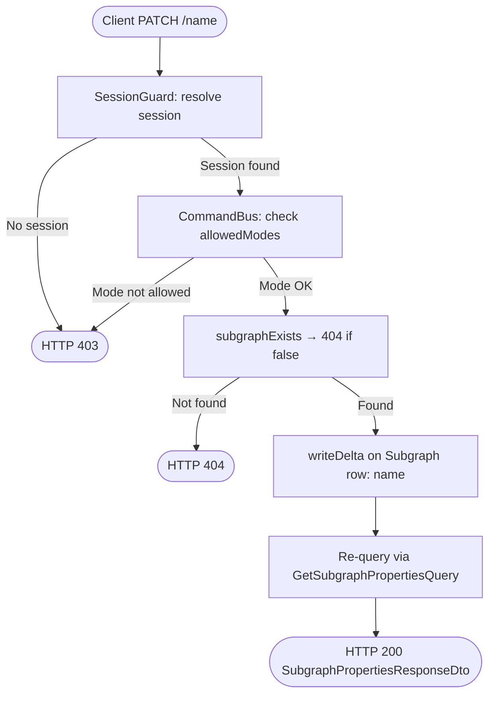
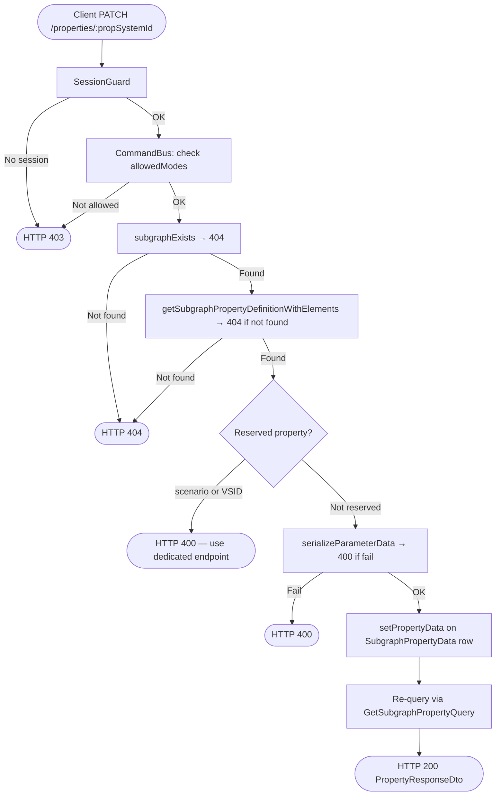
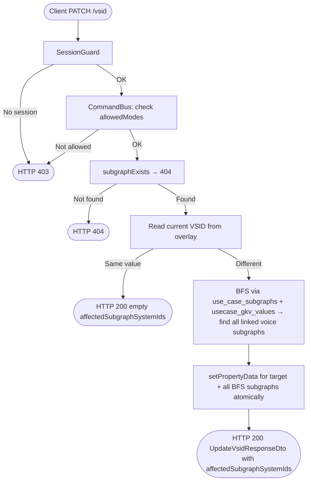

<!--
  Copyright (c) Qualcomm Technologies, Inc. and/or its subsidiaries.
  SPDX-License-Identifier: BSD-3-Clause
-->

# Set Subgraph Property Data — Low-Level Design (Draft)

**Feature folder:** `docs/property-data/`
**Status:** DRAFT
**Date:** 2026-08-27

---

## Requirements

Requirements source: [../set-subgraph-property-requirements.md](../set-subgraph-property-requirements.md)

| ID | Requirement |
|---|---|
| FR-SG-NAME | `PATCH /subgraphs/:id/name` — write subgraph name; staged; re-query → SubgraphPropertiesResponseDto |
| FR-SG-PROP | `PATCH /subgraphs/:id/properties/:propSystemId` — generic property update; reserved guard for scenario + VSID → 400; staged; re-query → PropertyResponseDto |
| FR-SG-VSID | `PATCH /subgraphs/:id/vsid` — BFS propagation to all connected voice subgraphs; staged; returns affectedSubgraphSystemIds |
| FR-CCR-01 | Active session required → 403 |
| FR-CCR-02 | DESIGNER / DIFF_MERGE modes only → 403 |
| FR-CCR-03/04 | All writes staged; visible via overlay read immediately |
| FR-CCR-05 | groupId in all responses |

---

## Section 0: Prerequisite — `serializeDefaultParameterData` in `serialize-elements.ts`

**Context:** `build-subgraph-with-defaults.ts` seeds all `SubgraphPropertyData` blobs as `null` because the utility to build a default binary payload doesn't exist yet (see the `TODO(add-module-calibration-defaults)` comment). The `setPropertyData` infra method resolves the property row by calling `SubgraphPropertyDataFetcher.fetchMany` and throws if the row is not found — but the row _will_ exist since it is created at subgraph-creation time. The problem is its `payload` is `null`, which is valid for reads but means the blob column is empty. This is fine for reads but the section is called out here because the commit `a54340d` from the `feature/use-case-designer` branch already implements `serializeDefaultParameterData`; this PR should take those changes directly rather than waiting for that branch to merge.

### 0.1 Files changed

| File | Change |
|---|---|
| `packages/core/src/application/usecase-designer/shared/serialize-elements.ts` | Add `serializeDefaultParameterData` + `buildDefaultElements` helpers (ported from commit `a54340d`) |
| `packages/core/src/application/usecase-designer/subgraph/build-subgraph-with-defaults.ts` | Replace `null` placeholder with `serializeDefaultParameterData(propDef)` |

### 0.2 `serializeDefaultParameterData`

**File:** `packages/core/src/application/usecase-designer/shared/serialize-elements.ts` (modified)

Appended after the existing `serializeParameterData` function:

```typescript
/**
 * Builds a binary blob from the default values declared in a parameter
 * definition's elementsStructure. Used to seed property rows at entity
 * creation time so they always have a valid (if default) payload.
 */
export function serializeDefaultParameterData(
  definition: ParameterDefinitionBase,
): SerializeResult {
  let schema: DefinitionElement[];
  try {
    schema = convertParamDefinition(definition.elementsStructure);
  } catch {
    return {ok: false, error: 'Failed to parse elementsStructure JSON'};
  }
  const defaultInputs = schema.map(def => buildDefaultElement(def));
  return serializeParameterData(definition, defaultInputs);
}

function buildDefaultElement(def: DefinitionElement): ElementCalData {
  switch (def.elementType) {
    case PARAMETER_ELEMENT_TYPE.ConfigElement:
      return {
        name: def.name ?? '',
        description: def.description ?? '',
        isReadOnly: def.isReadOnly ?? false,
        type: PARAMETER_ELEMENT_TYPE.ConfigElement,
        dataType: def.dataType,
        value: def.defaultValue ?? '0',
      } satisfies ConfigElementData;

    case PARAMETER_ELEMENT_TYPE.Struct:
      return {
        name: def.name,
        description: def.description ?? '',
        isReadOnly: false,
        type: PARAMETER_ELEMENT_TYPE.Struct,
        structType: def.structureType,
        value: def.elements.map(e => buildDefaultElement(e)),
      } satisfies StructData;

    case PARAMETER_ELEMENT_TYPE.ElementArray:
    case PARAMETER_ELEMENT_TYPE.StructArray: {
      const length = def.arrayLength ?? 0;
      return {
        name: def.name,
        description: def.description ?? '',
        isReadOnly: false,
        type: PARAMETER_ELEMENT_TYPE.ElementArray,
        template: [],
        value: Array.from({length}, () => buildDefaultElement(def.template)),
      } satisfies ElementArrayData;
    }
  }
}
```

The `serializeParameterData` call in `serializeDefaultParameterData` reuses the existing serialization path — no duplication of write logic.

**New imports needed** in `serialize-elements.ts`:
```typescript
import type {
  ConfigElementData,
  StructData,
  ElementArrayData,
} from '../../../domain/entities/definitions/common/types/element-data.js';
```
(These are already imported at the top of the file — verify before adding.)

### 0.3 Wire into `build-subgraph-with-defaults.ts`

**File:** `packages/core/src/application/usecase-designer/subgraph/build-subgraph-with-defaults.ts` (modified)

Replace the `null` placeholder:

```typescript
import {serializeDefaultParameterData} from '../shared/serialize-elements.js';

// inside buildSubgraphWithDefaults:
const properties = propertyDefinitions.map(propDef => {
  const serialized = serializeDefaultParameterData(propDef);
  return new SubgraphPropertyData(
    propDef.systemId,
    serialized.ok ? serialized.value : null,
  );
});
```

`propDef` satisfies `ParameterDefinitionBase` (`systemId`, `isReadOnly`, `elementsStructure`) — the existing `SubgraphPropertyDefinitionRecord` type already extends it.

If serialization fails for a given property definition (malformed `elementsStructure`), the blob falls back to `null` rather than throwing — matching the existing behaviour and avoiding a hard failure at subgraph creation time.

---

## Section 1: Architecture & Call Flow

The write path follows hexagonal + CQRS using **Command + CommandBus + UnitOfWork**. All three endpoints reuse existing command/handler stubs — the stubs are implemented (no new files for commands or handlers). The re-query after write uses the existing `GetSubgraphPropertiesQuery`.

### 1.1 High-Level Workflow Diagram

#### PATCH /name



#### PATCH /properties/:propSystemId



#### PATCH /vsid



### 1.2 File and Folder Organization

Files annotated **(existing)** already exist; **(modified)** means an existing file is changed; **(new)** means a new file.

#### Presentation Layer
```
packages/api/src/presentation/rest/modules/subgraph/
└── subgraph.controller.ts                                        (modified — implement name + property + vsid stubs)
```

#### Core Shared
```
packages/core/src/application/usecase-designer/
├── shared/
│   └── serialize-elements.ts                                         (modified — add serializeDefaultParameterData + buildDefaultElement)
└── subgraph/
    └── build-subgraph-with-defaults.ts                               (modified — replace null placeholder with serializeDefaultParameterData)
```

#### Core Layer
```
packages/core/src/application/
├── ports/persistence/repositories/subgraph/
│   └── subgraph.repository.ts                                    (modified — add setName, setPropertyData, getSubgraphWithProperties, getSubgraphIdsInSameUsecases)
├── ports/persistence/query-services/subgraph-property-definition/
│   └── subgraph-property-def-query-service.ts                    (modified — add getSubgraphPropertyDefinitionWithElements)
├── orchestration/cqrs/registries/
│   ├── command-handler-registry.ts                               (modified — inject queryServices into UpdateSubgraphPropertyHandler and UpdateSubgraphVsidHandler)
│   └── query-handler-registry.ts                                 (modified — register GetSubgraphPropertyHandler)
└── usecase-designer/subgraph/
    ├── subgraph-property-ids/
    │   └── subgraph-property-ids.ts                              (new — SUB_GRAPH_PROP_ID_SCENARIO_ID, SUB_GRAPH_PROP_ID_VSID, scenario value constants)
    ├── dto/
    │   └── subgraph-write-result-types.ts                        (modified — add groupId to VsidUpdateDtoSchema)
    ├── get-property/
    │   ├── get-subgraph-property.query.ts                        (new — single property by propertyDefinitionSystemId)
    │   └── get-subgraph-property.handler.ts                      (new — returns PropertyDataDto for single property)
    ├── patch/
    │   └── patch-subgraph.handler.ts                             (modified — implement setName logic, return { groupId })
    ├── update-property/
    │   ├── update-subgraph-property.command.ts                   (modified — data: unknown[] → elements: ParameterElementSummaryDto[])
    │   └── update-subgraph-property.handler.ts                   (modified — implement logic + reserved guard)
    └── update-vsid/
        ├── update-subgraph-vsid.command.ts                       (modified — data: unknown[] → elements: ParameterElementSummaryDto[])
        └── update-subgraph-vsid.handler.ts                       (modified — implement BFS propagation logic)
```

#### Infrastructure Layer
```
packages/infrastructure/persistence/src/persistence-typeorm-sqllite/
├── repositories/subgraph/
│   └── subgraph.repository.ts                                    (modified — implement setName, setPropertyData, getSubgraphWithProperties, getSubgraphIdsInSameUsecases)
└── queries/subgraph-property-definition/
    └── db-subgraph-property-def-query-service.ts                 (modified — implement getSubgraphPropertyDefinitionWithElements)
```

No schema changes — no migration needed.

### 1.3 Layer Responsibilities

```
Presentation (API)
  PATCH /name:
    → @UseGuards(SessionGuard)
    → new PatchSubgraphCommand(subgraphSystemId, dto.name)
    → CommandBus.execute(command, session) — returns { groupId: string }
    → re-query via GetSubgraphPropertiesQuery → SubgraphPropertiesResponseDto → 200

  PATCH /properties/:propSystemId:
    → @UseGuards(SessionGuard)
    → new UpdateSubgraphPropertyCommand(subgraphSystemId, propSystemId, dto.elements)
    → CommandBus.execute(command, session) — returns void
    → re-query via GetSubgraphPropertyQuery(projectId, subgraphSystemId, propSystemId) → PropertyDataDto → PropertyResponseDto → 200

  PATCH /vsid:
    → @UseGuards(SessionGuard)
    → new UpdateSubgraphVsidCommand(subgraphSystemId, dto.elements)
    → CommandBus.execute(command, session) — returns VsidUpdateDto
    → toApiResult(Result.ok(result)) → UpdateVsidResponseDto → 200

Core (Application)
  PatchSubgraphHandler (implements setName):
    fileSystemId = uow.getWriteContext().session.fileSystemId
    1. subgraphExists(subgraphSystemId, fileSystemId) → 404 if false
    2. uow.getSubgraphRepository().setName(subgraphSystemId, command.name)
    — no transaction needed (single delta write)

  UpdateSubgraphPropertyHandler:
    fileSystemId = uow.getWriteContext().session.fileSystemId
    1. subgraphExists(subgraphSystemId, fileSystemId) → 404 if false
    2. queryServices.subgraphPropertyDefQueryService.getSubgraphPropertyDefinitionWithElements(
         propertySystemId, fileSystemId) → 404 if fail
    3. Reserved guard: if propertyId === SCENARIO_ID or VSID_ID → throw InvalidOperationException → 400
    4. serializeParameterData(propDef, command.elements) → 400 if fail
    5. uow.getSubgraphRepository().setPropertyData(subgraphSystemId, propertySystemId, payload)
    — no transaction needed (single delta write)

  UpdateSubgraphVsidHandler:
    fileSystemId = uow.getWriteContext().session.fileSystemId
    1. getSubgraphWithProperties(subgraphSystemId, fileSystemId) → 404 if null
    2. Resolve VSID + Scenario property definitions via subgraphPropertyDefQueryService
    3. No-op if current VSID === requested VSID → return VsidUpdateDto { groupId, affectedSubgraphSystemIds: [] }
    4. BFS: getSubgraphIdsInSameUsecases(subgraphSystemId, fileSystemId)
         → for each hop: skip non-voice subgraphs, skip already-processed, skip if VSID already matches
         → zero-GKV usecases skipped inside getSubgraphIdsInSameUsecases
    5. Write new VSID to target + all BFS-discovered subgraphs atomically:
         uow.startTransaction()
         try:
           setPropertyData for each affected subgraph (Promise.all safe — same QueryRunner)
           uow.commit()
         catch:
           if uow.isInTransaction() → uow.rollback(); throw
    6. Return VsidUpdateDto { groupId, affectedSubgraphSystemIds }

Infrastructure (Persistence)
  TypeOrmSubgraphRepository.setName:
    → writeDelta({ targetTable: Subgraph, targetSystemId: subgraphSystemId,
                   aggregateId: subgraphSystemId, delta: { name } })

  TypeOrmSubgraphRepository.setPropertyData:
    → SubgraphPropertyDataFetcher.fetchMany([subgraphSystemId], sessionId) to resolve prop row systemId
    → prop row not found → throw (property must exist at subgraph creation)
    → writeDelta({ targetTable: SubgraphPropertyData, targetSystemId: prop.systemId,
                   aggregateId: subgraphSystemId, delta: { payload: data } })

  TypeOrmSubgraphRepository.getSubgraphWithProperties:
    → delegates to SubgraphOverlayFetcher.fetchOne(subgraphSystemId, fileSystemId, sessionId)
    → returns OverlaidSubgraph | null (properties array included)
```

---

## Section 2: Presentation Layer

**File:** `packages/api/src/presentation/rest/modules/subgraph/subgraph.controller.ts` (modified)

### 2.1 PATCH /name

The existing `patchSubgraph` method (`PATCH /:subgraphSystemId`) already handles the `PatchSubgraphCommand`. It is refactored to re-query and return `SubgraphPropertiesResponseDto` instead of throwing `NotImplementedException`.

```typescript
@Patch('/:subgraphSystemId')
@UseGuards(SessionGuard)
async patchSubgraph(
  @Param('projectId') projectId: string,
  @Param('subgraphSystemId', ParseIntPipe) subgraphSystemId: number,
  @Body() dto: PatchSubgraphRequestDto,
  @ArcSession() session: ActiveSession,
): Promise<ApiResult<SubgraphPropertiesResponseDto>> {
  await this.commandBus.execute<{groupId: string}>(
    new PatchSubgraphCommand(subgraphSystemId, dto.name),
    session,
  );
  const query = new GetSubgraphPropertiesQuery(
    Number.parseInt(projectId, 10),
    subgraphSystemId,
    'api-client',
  );
  const result = await this.queryBus.execute<Result<SubgraphPropertiesResponseDto>>(query);
  return toApiResult(result);
}
```

`PatchSubgraphRequestDto` already exists with `name?: string` — no change needed.

### 2.2 PATCH /properties/:propSystemId

The existing `updateSubgraphProperty` stub is implemented. Uses a new `GetSubgraphPropertyQuery` (singular — by property definition systemId) for the re-query, mirroring the `GetContainerPropertyQuery` pattern from `set-container-property-design.md`:

```typescript
@Patch('/:subgraphSystemId/properties/:propSystemId')
@UseGuards(SessionGuard)
async updateSubgraphProperty(
  @Param('projectId') projectId: string,
  @Param('subgraphSystemId', ParseIntPipe) subgraphSystemId: number,
  @Param('propSystemId', ParseIntPipe) propSystemId: number,
  @Body() dto: UpdatePropertyRequestDto,
  @ArcSession() session: ActiveSession,
): Promise<ApiResult<PropertyResponseDto>> {
  await this.commandBus.execute<void>(
    new UpdateSubgraphPropertyCommand(subgraphSystemId, propSystemId, dto.elements),
    session,
  );
  const query = new GetSubgraphPropertyQuery(
    Number.parseInt(projectId, 10),
    subgraphSystemId,
    propSystemId,
    'api-client',
  );
  const result = await this.queryBus.execute<Result<PropertyDataDto>>(query);
  return toApiResult(result, data => mapPropertyToDto(data));
}
```

`GetSubgraphPropertyQuery` takes `(projectId, subgraphSystemId, propertyDefinitionSystemId, clientId)` — re-queries the single updated property by its definition systemId. `mapPropertyToDto` converts `PropertyDataDto` → `PropertyResponseDto` (same mapper used in the container LLD).

### 2.3 PATCH /vsid

The existing `setSubgraphVsid` stub already calls `UpdateSubgraphVsidCommand` and maps `VsidUpdateDto` to `UpdateVsidResponseDto`. The command constructor is updated to accept `elements` instead of `[dto]`.

```typescript
@Patch('/:subgraphSystemId/vsid')
@UseGuards(SessionGuard)
async setSubgraphVsid(
  @Param('subgraphSystemId', ParseIntPipe) subgraphSystemId: number,
  @Body() dto: UpdatePropertyRequestDto,
  @ArcSession() session: ActiveSession,
): Promise<ApiResult<UpdateVsidResponseDto>> {
  const result = await this.commandBus.execute<VsidUpdateDto>(
    new UpdateSubgraphVsidCommand(subgraphSystemId, dto.elements),
    session,
  );
  return toApiResult(Result.ok(result));
}
```

---

## Section 3: Core Layer

### 3.1 SubgraphPropertyIds constants

**File:** `packages/core/src/application/usecase-designer/subgraph/subgraph-property-ids/subgraph-property-ids.ts` (new)

```typescript
export const SUB_GRAPH_PROP_ID_SCENARIO_ID = 0x08001010;
export const SUB_GRAPH_PROP_ID_VSID        = 0x080010CC;

export const SUB_GRAPH_PROP_ID_SCENARIO_VALUE_AUDIO_PLAYBACK  = 0x00000001;
export const SUB_GRAPH_PROP_ID_SCENARIO_VALUE_AUDIO_RECORDING = 0x00000002;
export const SUB_GRAPH_PROP_ID_SCENARIO_VALUE_VOICE_CALL      = 0x00000003;
```

The guard uses `propDef.propertyId` (natural key from the definition row), not `propertySystemId`.

### 3.2 PatchSubgraphHandler (setName)

**File:** `packages/core/src/application/usecase-designer/subgraph/patch/patch-subgraph.handler.ts` (modified)

```typescript
export class PatchSubgraphHandler implements CommandHandler<PatchSubgraphCommand, {groupId: string}> {
  constructor(private readonly uow: UnitOfWork) {}

  async handle(command: PatchSubgraphCommand): Promise<{groupId: string}> {
    const {session, groupId} = this.uow.getWriteContext();
    const fileSystemId = session.fileSystemId;

    const exists = await this.uow.getSubgraphRepository()
      .subgraphExists(command.subgraphSystemId, fileSystemId);
    if (!exists) {
      throw new ResourceNotFoundException(
        `Subgraph ${command.subgraphSystemId} not found`,
      );
    }

    if (command.name !== undefined) {
      await this.uow.getSubgraphRepository()
        .setName(command.subgraphSystemId, command.name);
    }

    return {groupId};
  }
}
```

### 3.3 UpdateSubgraphPropertyCommand (modified)

**File:** `packages/core/src/application/usecase-designer/subgraph/update-property/update-subgraph-property.command.ts` (modified)

`data: unknown[]` → `elements: ParameterElementSummaryDto[]`:

```typescript
export class UpdateSubgraphPropertyCommand extends BaseCommand {
  static override readonly requiresSession = true;
  static override readonly allowedModes: readonly SessionMode[] = [
    SESSION_MODE.Designer,
    SESSION_MODE.DiffMerge,
  ];

  constructor(
    public readonly subgraphSystemId: number,
    public readonly propertySystemId: number,
    public readonly elements: ParameterElementSummaryDto[],
  ) {
    super();
  }
}
```

### 3.4 UpdateSubgraphPropertyHandler

**File:** `packages/core/src/application/usecase-designer/subgraph/update-property/update-subgraph-property.handler.ts` (modified)

```typescript
export class UpdateSubgraphPropertyHandler implements CommandHandler<
  UpdateSubgraphPropertyCommand,
  void
> {
  constructor(
    private readonly uow: UnitOfWork,
    private readonly queryServices: QueryServices,
  ) {}

  async handle(command: UpdateSubgraphPropertyCommand): Promise<void> {
    const {session} = this.uow.getWriteContext();
    const fileSystemId = session.fileSystemId;

    // Step 1: subgraph existence
    const exists = await this.uow.getSubgraphRepository()
      .subgraphExists(command.subgraphSystemId, fileSystemId);
    if (!exists) {
      throw new ResourceNotFoundException(
        `Subgraph ${command.subgraphSystemId} not found`,
      );
    }

    // Step 2: property definition existence (with elementsStructure for serialization)
    const defResult = await this.queryServices.subgraphPropertyDefQueryService
      .getSubgraphPropertyDefinitionWithElements(command.propertySystemId, fileSystemId);
    if (defResult.kind === RESULT_KIND.Fail) {
      throw new ResourceNotFoundException(
        `Property definition ${command.propertySystemId} not found`,
      );
    }
    const propDef = defResult.data;

    // Step 3: reserved property guard (enforced here, not in controller)
    if (
      propDef.propertyId === SUB_GRAPH_PROP_ID_SCENARIO_ID ||
      propDef.propertyId === SUB_GRAPH_PROP_ID_VSID
    ) {
      const endpoint =
        propDef.propertyId === SUB_GRAPH_PROP_ID_SCENARIO_ID
          ? 'PATCH /subgraphs/:id/scenario'
          : 'PATCH /subgraphs/:id/vsid';
      throw new InvalidOperationException(
        `Property ${propDef.name} is reserved. Use ${endpoint} instead.`,
      );
    }

    // Step 4: serialize elements → Uint8Array
    const serialized = serializeParameterData(propDef, command.elements);
    if (!serialized.ok) {
      throw new BadRequestException(serialized.error);
    }

    // Step 5: staged write
    await this.uow.getSubgraphRepository()
      .setPropertyData(command.subgraphSystemId, command.propertySystemId, serialized.value);
  }
}
```

Registry entry:
```typescript
this.commandHandlerFactories.set(UpdateSubgraphPropertyCommand, {
  create: deps => new UpdateSubgraphPropertyHandler(deps.uow, deps.queryServices),
});
```

### 3.5 UpdateSubgraphVsidCommand (modified)

**File:** `packages/core/src/application/usecase-designer/subgraph/update-vsid/update-subgraph-vsid.command.ts` (modified)

`data: unknown[]` → `elements: ParameterElementSummaryDto[]`:

```typescript
export class UpdateSubgraphVsidCommand extends BaseCommand {
  static override readonly requiresSession = true;
  static override readonly allowedModes: readonly SessionMode[] = [
    SESSION_MODE.Designer,
    SESSION_MODE.DiffMerge,
  ];

  constructor(
    public readonly subgraphSystemId: number,
    public readonly elements: ParameterElementSummaryDto[],
  ) {
    super();
  }
}
```

### 3.6 UpdateSubgraphVsidHandler

**File:** `packages/core/src/application/usecase-designer/subgraph/update-vsid/update-subgraph-vsid.handler.ts` (modified)

The BFS algorithm propagates the new VSID to all Voice subgraphs connected via the same non-zero-GKV usecases:

1. Start with the target subgraph in a queue.
2. For each subgraph dequeued: find all usecases containing it (`use_case_subgraphs`).
3. Skip zero-GKV usecases (those with no rows in `usecase_gkv_values`).
4. For each non-zero-GKV usecase: find all other subgraphs in that usecase.
5. Filter to **Voice subgraphs only** (scenario === Voice) — non-voice subgraphs are skipped.
6. Skip subgraphs already processed, and skip subgraphs whose VSID already equals the new value.
7. Add newly found subgraphs to the queue and mark them processed.
8. Write new VSID to the target + all collected subgraphs atomically.

```typescript
export class UpdateSubgraphVsidHandler implements CommandHandler<
  UpdateSubgraphVsidCommand,
  VsidUpdateDto
> {
  constructor(
    private readonly uow: UnitOfWork,
    private readonly queryServices: QueryServices,
  ) {}

  async handle(command: UpdateSubgraphVsidCommand): Promise<VsidUpdateDto> {
    const {session, groupId} = this.uow.getWriteContext();
    const fileSystemId = session.fileSystemId;

    // Step 1: subgraph existence + load properties
    const subgraph = await this.uow.getSubgraphRepository()
      .getSubgraphWithProperties(command.subgraphSystemId, fileSystemId);
    if (!subgraph) {
      throw new ResourceNotFoundException(
        `Subgraph ${command.subgraphSystemId} not found`,
      );
    }

    // Step 2: resolve VSID + Scenario property definitions
    const vsidDefResult = await this.queryServices.subgraphPropertyDefQueryService
      .getAllSubgraphPropertyDefinitionsSummary(fileSystemId, SUB_GRAPH_PROP_ID_VSID);
    if (vsidDefResult.kind === RESULT_KIND.Fail || vsidDefResult.data.length === 0) {
      throw new ResourceNotFoundException('VSID property definition not found');
    }
    const vsidDef = vsidDefResult.data[0];

    const scenarioDefResult = await this.queryServices.subgraphPropertyDefQueryService
      .getAllSubgraphPropertyDefinitionsSummary(fileSystemId, SUB_GRAPH_PROP_ID_SCENARIO_ID);
    const scenarioDef = scenarioDefResult.kind !== RESULT_KIND.Fail
      ? scenarioDefResult.data[0]
      : undefined;

    // Step 3: read current VSID on target subgraph
    const vsidProp = subgraph.properties.find(
      p => p.propertySystemId === vsidDef.systemId,
    );
    const currentVsid = vsidProp?.payload
      ? new BinaryDataReader(vsidProp.payload as Uint8Array).readUInt32()
      : undefined;

    // Step 4: extract requested VSID — elements[0].value is uint32 as string
    const requestedVsid = Number(command.elements[0]?.value);

    // Step 5: no-op if same value
    if (currentVsid === requestedVsid) {
      return {groupId, affectedSubgraphSystemIds: []};
    }

    // Step 6: serialize new VSID payload
    const vsidDefWithElements = await this.queryServices.subgraphPropertyDefQueryService
      .getSubgraphPropertyDefinitionWithElements(vsidDef.systemId, fileSystemId);
    if (vsidDefWithElements.kind === RESULT_KIND.Fail) {
      throw new ResourceNotFoundException('VSID property definition (with elements) not found');
    }
    const serialized = serializeParameterData(vsidDefWithElements.data, command.elements);
    if (!serialized.ok) {
      throw new BadRequestException(serialized.error);
    }

    // Step 7: BFS across use_case_subgraphs + usecase_gkv_values
    // getSubgraphIdsInSameUsecases encapsulates the two-table query and zero-GKV filter.
    const processedIds = new Set<number>([command.subgraphSystemId]);
    const toWrite = new Set<number>([command.subgraphSystemId]);
    const queue: number[] = [command.subgraphSystemId];

    while (queue.length > 0) {
      const currentId = queue.shift()!;
      const linkedIds = await this.uow.getSubgraphRepository()
        .getSubgraphIdsInSameUsecases(currentId, fileSystemId);

      for (const linkedId of linkedIds) {
        if (processedIds.has(linkedId)) continue;
        processedIds.add(linkedId);

        // Load subgraph properties to check scenario + current VSID
        const linkedSg = await this.uow.getSubgraphRepository()
          .getSubgraphWithProperties(linkedId, fileSystemId);
        if (!linkedSg) continue;

        // Skip non-voice subgraphs
        if (scenarioDef) {
          const scenarioProp = linkedSg.properties.find(
            p => p.propertySystemId === scenarioDef.systemId,
          );
          const scenarioValue = scenarioProp?.payload
            ? new BinaryDataReader(scenarioProp.payload as Uint8Array).readUInt32()
            : undefined;
          if (scenarioValue !== SUB_GRAPH_PROP_ID_SCENARIO_VALUE_VOICE_CALL) continue;
        }

        // Skip if VSID already matches (but still BFS-expand from it)
        const linkedVsidProp = linkedSg.properties.find(
          p => p.propertySystemId === vsidDef.systemId,
        );
        const linkedVsid = linkedVsidProp?.payload
          ? new BinaryDataReader(linkedVsidProp.payload as Uint8Array).readUInt32()
          : undefined;

        if (linkedVsid !== requestedVsid) {
          toWrite.add(linkedId);
        }
        queue.push(linkedId); // always expand BFS from this subgraph
      }
    }

    // Step 8: write new VSID to all collected subgraphs atomically
    await this.uow.startTransaction();
    try {
      await Promise.all(
        [...toWrite].map(sgId =>
          this.uow.getSubgraphRepository()
            .setPropertyData(sgId, vsidDef.systemId, serialized.value),
        ),
      );
      await this.uow.commit();
    } catch (error) {
      if (this.uow.isInTransaction()) await this.uow.rollback();
      throw error;
    }

    return {
      groupId,
      affectedSubgraphSystemIds: [...toWrite].map(String),
    };
  }
}
```

**Note — `VsidUpdateDtoSchema` needs `groupId`:** The existing schema in `subgraph-write-result-types.ts` is:
```typescript
export const VsidUpdateDtoSchema = z.object({
  affectedSubgraphSystemIds: z.array(z.string()),
});
```
This is missing `groupId` (required by FR-CCR-05). It must be extended to:
```typescript
export const VsidUpdateDtoSchema = z.object({
  groupId: z.string(),
  affectedSubgraphSystemIds: z.array(z.string()),
});
```
**File:** `packages/core/src/application/usecase-designer/subgraph/dto/subgraph-write-result-types.ts` (modified)

**New port method on `SubgraphRepository`** (see Section 3.7):
```typescript
getSubgraphIdsInSameUsecases(subgraphSystemId: number, fileSystemId: number): Promise<number[]>
```
This encapsulates:
1. `use_case_subgraphs WHERE subgraphSystemId = X` → set of `usecaseSystemId`s
2. Filter out zero-GKV usecases: keep only those with rows in `usecase_gkv_values`
3. `use_case_subgraphs WHERE usecaseSystemId IN kept-set` → set of other `subgraphSystemId`s

### 3.7 SubgraphRepository Port Extensions

**File:** `packages/core/src/application/ports/persistence/repositories/subgraph/subgraph.repository.ts` (modified)

```typescript
export interface SubgraphWithProperties {
  systemId: number;
  properties: Array<{
    systemId: number;
    propertySystemId: number;
    payload: Uint8Array | null;
  }>;
}

export interface SubgraphRepository {
  subgraphExists(systemId: number, fileSystemId: number): Promise<boolean>;
  createSubgraph(subgraph: Subgraph, options?: EditOptions): Promise<void>;

  // Returns subgraph with property rows (overlay-aware). null if not found.
  getSubgraphWithProperties(
    subgraphSystemId: number,
    fileSystemId: number,
  ): Promise<SubgraphWithProperties | null>;

  // Stages a name delta on the Subgraph row.
  setName(
    subgraphSystemId: number,
    name: string,
  ): Promise<void>;

  // Stages a payload delta on an existing SubgraphPropertyData row.
  // Throws if property row does not exist in the effective state.
  setPropertyData(
    subgraphSystemId: number,
    propertySystemId: number,
    data: Uint8Array,
  ): Promise<void>;

  // Returns all subgraphSystemIds that share at least one non-zero-GKV usecase
  // with the given subgraph. Used by the VSID BFS.
  // Step 1: use_case_subgraphs WHERE subgraphSystemId = X → usecaseSystemIds
  // Step 2: filter out zero-GKV usecases (no rows in usecase_gkv_values)
  // Step 3: use_case_subgraphs WHERE usecaseSystemId IN kept-set → other subgraphSystemIds
  // Does NOT include the input subgraphSystemId itself.
  getSubgraphIdsInSameUsecases(
    subgraphSystemId: number,
    fileSystemId: number,
  ): Promise<number[]>;
}
```

---

### 3.8 SubgraphPropertyDefQueryService Port Extension

**File:** `packages/core/src/application/ports/persistence/query-services/subgraph-property-definition/subgraph-property-def-query-service.ts` (modified)

Add one method — mirrors the existing `getContainerPropertyDefinitionWithElements` on `ContainerPropertyDefQueryService`:

```typescript
export interface SubgraphPropertyDefQueryService {
  // ... existing methods ...

  // Returns a single subgraph property definition including elementsStructure.
  // Result.fail with ERROR_CODES.ENTITY_NOT_FOUND if not found.
  getSubgraphPropertyDefinitionWithElements(
    propertySystemId: number,
    fileSystemId: number,
  ): Promise<Result<SubgraphPropertyDefinitionWithElementsReadModel>>;
}
```

`SubgraphPropertyDefinitionWithElementsReadModel` already exists at:
`packages/core/src/application/ports/persistence/query-services/subgraph-property-definition/subgraph-property-definition-with-elements-read-model.ts`

No new types needed.

**Infra implementation** — `DbSubgraphPropertyDefQueryService` (modified):

Delegates to the existing `fetcher.fetchAll`, filters in memory — same pattern as the existing `getSubgraphPropertyDefinition` method in the same class:

```typescript
async getSubgraphPropertyDefinitionWithElements(
  propertySystemId: number,
  fileSystemId: number,
): Promise<Result<SubgraphPropertyDefinitionWithElementsReadModel>> {
  try {
    const session = await this.sessionRepo.findActiveSessionByFileSystemId(fileSystemId);
    const rows = await this.fetcher.fetchAll(fileSystemId, session?.sessionId ?? null);
    const match = rows.find(r => r.systemId === propertySystemId);
    return match
      ? Result.ok(this.toDetailWithElementsReadModel(match))
      : Result.fail({
          code: ERROR_CODES.ENTITY_NOT_FOUND,
          message: `SubgraphPropertyDefinition not found for systemId=${propertySystemId}`,
          severity: IssueSeverity.Error,
        });
  } catch (error) {
    return Result.fail({
      code: ERROR_CODES.INTERNAL_ERROR,
      message: error instanceof Error ? error.message : 'Failed to load subgraph property definition',
      severity: IssueSeverity.Error,
    });
  }
}
```

`toDetailWithElementsReadModel` already exists in `DbSubgraphPropertyDefQueryService` — no new mapper needed.

---

### 3.9 GetSubgraphPropertyQuery and Handler (singular)

Mirrors `GetContainerPropertyQuery` from `set-container-property-design.md` exactly.

**Files:**
- `packages/core/src/application/usecase-designer/subgraph/get-property/get-subgraph-property.query.ts` (new)
- `packages/core/src/application/usecase-designer/subgraph/get-property/get-subgraph-property.handler.ts` (new)

```typescript
export class GetSubgraphPropertyQuery extends BaseQuery {
  public readonly projectId: number;
  public readonly subgraphSystemId: number;
  public readonly propertySystemId: number; // property definition systemId

  constructor(
    projectId: number,
    subgraphSystemId: number,
    propertySystemId: number,
    clientId: string,
  ) {
    super(clientId);
    this.projectId = projectId;
    this.subgraphSystemId = subgraphSystemId;
    this.propertySystemId = propertySystemId;
  }
}
```

```typescript
export class GetSubgraphPropertyHandler implements QueryHandler<
  GetSubgraphPropertyQuery,
  Promise<Result<PropertyDataDto>>
> {
  constructor(private readonly queryServices: QueryServices) {}

  async handle(query: GetSubgraphPropertyQuery): Promise<Result<PropertyDataDto>> {
    const fileSystemId = await this.queryServices.projectQueryService
      .getFileIdByProjectId(query.projectId);

    // Step 1: load all property payloads for the subgraph (overlay-aware)
    const payloadsResult = await this.queryServices.subgraphQueryService
      .findPropertyPayloads(query.subgraphSystemId, fileSystemId);
    if (payloadsResult.kind === RESULT_KIND.Fail) {
      throw new Error(payloadsResult.issues[0]?.message ?? 'Failed to load subgraph properties');
    }
    if (payloadsResult.data === null) {
      throw new ResourceNotFoundException(`Subgraph ${query.subgraphSystemId} not found`);
    }

    // Step 2: find the specific property payload by definition systemId
    const payload = payloadsResult.data.find(
      p => p.propertySystemId === query.propertySystemId,
    );
    if (!payload) {
      throw new ResourceNotFoundException(
        `Property ${query.propertySystemId} not found on subgraph ${query.subgraphSystemId}`,
      );
    }

    // Step 3: load definition with elementsStructure for parsing
    const defResult = await this.queryServices.subgraphPropertyDefQueryService
      .getSubgraphPropertyDefinitionWithElements(query.propertySystemId, fileSystemId);
    if (defResult.kind === RESULT_KIND.Fail) {
      throw new ResourceNotFoundException(`Property definition ${query.propertySystemId} not found`);
    }

    // Step 4: parse elements from binary payload
    const elements = payload.payload !== null
      ? parseParameterData(payload.payload, defResult.data.elementsStructure)
      : [];

    return Result.ok({
      systemId: payload.systemId,
      propertyId: defResult.data.propertyId,
      propertyName: defResult.data.name,
      elements,
    });
  }
}
```

Registration in `query-handler-registry.ts`:
```typescript
this.queryHandlerFactories.set(GetSubgraphPropertyQuery, {
  create: deps => new GetSubgraphPropertyHandler(deps.queryServices),
});
```

---

## Section 4: Infrastructure Layer

**File:** `packages/infrastructure/persistence/src/persistence-typeorm-sqllite/repositories/subgraph/subgraph.repository.ts` (modified)

### 4.1 getSubgraphWithProperties

Delegates to `SubgraphOverlayFetcher.fetchOne` — properties now returned as `SubgraphPropertyDataBase[]`
via the injected `SubgraphPropertyDataFetcher`.

```typescript
async getSubgraphWithProperties(
  subgraphSystemId: number,
  fileSystemId: number,
): Promise<SubgraphWithProperties | null> {
  const sessionId = this.uow.getWriteContext().session.sessionId;
  const overlaid = await this.subgraphFetcher.fetchOne(
    subgraphSystemId,
    fileSystemId,
    sessionId,
  );
  if (!overlaid) return null;
  return {
    systemId: overlaid.systemId,
    properties: overlaid.properties.map(p => ({
      systemId: p.systemId,
      propertySystemId: p.subgraphPropertySystemId,
      payload: p.payload as Uint8Array | null,
    })),
  };
}
```

**Constructor note:** `SubgraphOverlayFetcher` now requires four dependencies:
`manager, editActionsSvc, SubgraphPropertyDataFetcher, SubgraphSgkvFetcher`.
The repository constructor must inject all four — same pattern as `TypeOrmContainerRepository`.

### 4.2 setName

```typescript
async setName(
  subgraphSystemId: number,
  name: string,
): Promise<void> {
  const {session, groupId} = this.uow.getWriteContext();
  await this.writer.writeDelta(
    {
      targetTable:    ENTITY_NAMES.Subgraph,
      targetSystemId: subgraphSystemId,
      aggregateId:    subgraphSystemId,
      delta:          {name},
    },
    session.sessionId,
    groupId,
    this.manager,
  );
}
```

### 4.3 setPropertyData

Uses `SubgraphPropertyDataFetcher.fetchMany` to resolve the property row `systemId` — avoids
loading the full subgraph row just to find a property PK.

```typescript
async setPropertyData(
  subgraphSystemId: number,
  propertySystemId: number,
  data: Uint8Array,
): Promise<void> {
  const {session, groupId} = this.uow.getWriteContext();

  // Resolve the SubgraphPropertyData row's systemId via the property data fetcher
  const propRows = await this.propertyDataFetcher.fetchMany(
    [subgraphSystemId],
    session.sessionId,
  );
  const prop = propRows.find(
    p => p.subgraphPropertySystemId === propertySystemId,
  );
  if (!prop) {
    throw new Error(
      `SubgraphPropertyData for property ${propertySystemId} not found on ` +
      `subgraph ${subgraphSystemId}. Ensure the property is initialised at subgraph creation.`,
    );
  }
  await this.writer.writeDelta(
    {
      targetTable:    ENTITY_NAMES.SubgraphPropertyData,
      targetSystemId: prop.systemId,
      aggregateId:    subgraphSystemId,
      delta:          {payload: data},
    },
    session.sessionId,
    groupId,
    this.manager,
  );
}
```

### 4.4 PendingChangeWriter Specs

**`setName`:**

| Field | Value |
|---|---|
| `targetTable` | `Subgraph` |
| `targetSystemId` | `subgraphSystemId` |
| `aggregateId` | `subgraphSystemId` |
| `delta` | `{ name: "<string>" }` |

**`setPropertyData`:**

| Field | Value |
|---|---|
| `targetTable` | `SubgraphPropertyData` |
| `targetSystemId` | `prop.systemId` (PK of the property data row) |
| `aggregateId` | `subgraphSystemId` |
| `delta` | `{ payload: <Uint8Array> }` |

### 4.5 getSubgraphIdsInSameUsecases

Pure SQL — no overlay needed. The `use_case_subgraphs` and `usecase_gkv_values` tables are not overlaid (they are not part of the staging model).

```typescript
async getSubgraphIdsInSameUsecases(
  subgraphSystemId: number,
  fileSystemId: number,
): Promise<number[]> {
  // Step 1: find all usecases containing this subgraph
  const usecaseRows = await this.manager
    .getRepository(ENTITY_NAMES.UseCaseSubgraph)
    .createQueryBuilder('ucs')
    .select('ucs.usecaseSystemId')
    .where('ucs.subgraphSystemId = :subgraphSystemId', {subgraphSystemId})
    .getRawMany<{usecaseSystemId: number}>();

  if (usecaseRows.length === 0) return [];

  const allUsecaseIds = usecaseRows.map(r => r.usecaseSystemId);

  // Step 2: filter to non-zero-GKV usecases only
  const gkvRows = await this.manager
    .getRepository(ENTITY_NAMES.UsecaseGkvValues)
    .createQueryBuilder('ugkv')
    .select('DISTINCT ugkv.usecaseSystemId')
    .where('ugkv.usecaseSystemId IN (:...ids)', {ids: allUsecaseIds})
    .getRawMany<{usecaseSystemId: number}>();

  if (gkvRows.length === 0) return [];

  const nonZeroGkvUsecaseIds = gkvRows.map(r => r.usecaseSystemId);

  // Step 3: find all other subgraphs in those usecases
  const linkedRows = await this.manager
    .getRepository(ENTITY_NAMES.UseCaseSubgraph)
    .createQueryBuilder('ucs')
    .select('DISTINCT ucs.subgraphSystemId')
    .where('ucs.usecaseSystemId IN (:...ids)', {ids: nonZeroGkvUsecaseIds})
    .andWhere('ucs.subgraphSystemId != :subgraphSystemId', {subgraphSystemId})
    .getRawMany<{subgraphSystemId: number}>();

  return linkedRows.map(r => r.subgraphSystemId);
}
```

`ENTITY_NAMES.UseCaseSubgraph` and `ENTITY_NAMES.UsecaseGkvValues` must be added to `entity-table-names.ts` if not already present.

---

## Section 5: Testing Strategy

### Unit Tests

#### serializeDefaultParameterData

**File:** `packages/core/tests/unit/application/usecase-designer/shared/serialize-default-parameter-data.spec.ts` (new)

| Scenario | Expected outcome |
|---|---|
| Single `ConfigElement` with `defaultValue` | serialized blob contains that value |
| Single `ConfigElement` with no `defaultValue` | serialized blob contains `0` |
| `Struct` with nested `ConfigElement` children | all children use default values |
| `ElementArray` with `arrayLength: 3` | three default items serialized |
| Malformed `elementsStructure` JSON | returns `{ ok: false }` |

#### buildSubgraphWithDefaults (updated)

**File:** `packages/core/tests/unit/application/usecase-designer/subgraph/build-subgraph-with-defaults.spec.ts` (new or extend)

| Scenario | Expected outcome |
|---|---|
| Valid `elementsStructure` | property blob is non-null `Uint8Array` |
| Malformed `elementsStructure` | property blob falls back to `null` (no throw) |

#### PatchSubgraphHandler

**File:** `packages/core/tests/unit/application/usecase-designer/subgraph/patch/patch-subgraph.handler.spec.ts` (new)

| Scenario | Expected outcome |
|---|---|
| Subgraph not found | throws `ResourceNotFoundException` → 404 |
| Name provided | `setName` called with correct args |
| Name undefined | `setName` NOT called |

#### UpdateSubgraphPropertyHandler

**File:** `packages/core/tests/unit/application/usecase-designer/subgraph/update-property/update-subgraph-property.handler.spec.ts` (new)

| Scenario | Expected outcome |
|---|---|
| Subgraph not found | throws `ResourceNotFoundException` → 404 |
| Property definition not found | throws `ResourceNotFoundException` → 404 |
| `propertyId` === SCENARIO_ID | throws `InvalidOperationException` → 400 |
| `propertyId` === VSID_ID | throws `InvalidOperationException` → 400 |
| Serialization fails | throws `BadRequestException` → 400 |
| Valid property | `setPropertyData` called with serialized payload |

#### UpdateSubgraphVsidHandler

**File:** `packages/core/tests/unit/application/usecase-designer/subgraph/update-vsid/update-subgraph-vsid.handler.spec.ts` (new)

| Scenario | Expected outcome |
|---|---|
| Subgraph not found | throws `ResourceNotFoundException` → 404 |
| VSID definition not found | throws `ResourceNotFoundException` → 404 |
| Current VSID === requested VSID | returns `{ groupId, affectedSubgraphSystemIds: [] }`; no writes |
| No linked subgraphs (zero-GKV only) | only target subgraph written; `affectedSubgraphSystemIds` has one entry |
| Linked subgraph is not Voice | skipped; not in `affectedSubgraphSystemIds` |
| Linked Voice subgraph with same VSID | not written but BFS still expands from it |
| BFS finds linked Voice subgraphs | all written atomically; all in `affectedSubgraphSystemIds` |
| Write throws | `rollback()` called; error re-thrown |
| VSID serialization fails | throws `BadRequestException` → 400 |

### Integration Tests

**File:** `packages/infrastructure/persistence/tests/integration/repositories/subgraph/subgraph-property.repository.spec.ts` (new)

| Scenario | Expected outcome |
|---|---|
| `setName` — writes delta on Subgraph row | `edit_actions` row with `targetTable=Subgraph`, `delta={ name }` |
| `setName` — prior pending change exists | old row superseded; new merged row inserted |
| `setPropertyData` — writes delta on SubgraphPropertyData row | `edit_actions` row with `targetTable=SubgraphPropertyData`, `delta={ payload }` |
| `setPropertyData` — property row not on subgraph | throws |
| `getSubgraphWithProperties` — base row | returns subgraph with property array |
| `getSubgraphWithProperties` — pending CREATE overlay | includes staged property |
| `getSubgraphWithProperties` — pending DELETE overlay | excludes deleted property |
| `getSubgraphWithProperties` — not found | returns null |
| `getSubgraphIdsInSameUsecases` — no usecases | returns `[]` |
| `getSubgraphIdsInSameUsecases` — all usecases are zero-GKV | returns `[]` |
| `getSubgraphIdsInSameUsecases` — one non-zero-GKV usecase with two subgraphs | returns the other subgraph ID |
| `getSubgraphIdsInSameUsecases` — multiple usecases, deduped result | returns distinct subgraph IDs only |
| `getSubgraphIdsInSameUsecases` — never returns the input subgraphSystemId | self excluded |

**File:** `packages/infrastructure/persistence/tests/integration/queries/subgraph-property-definition/db-subgraph-property-def.spec.ts` (new or existing — add cases)

| Scenario | Expected outcome |
|---|---|
| `getSubgraphPropertyDefinitionWithElements` — found | returns `SubgraphPropertyDefinitionWithElementsReadModel` with `elementsStructure` populated |
| `getSubgraphPropertyDefinitionWithElements` — not found | returns `Result.fail` with `ENTITY_NOT_FOUND` |
| `getSubgraphPropertyDefinitionWithElements` — session overlay creates definition | returns created row |

### End-to-End Tests

**File:** `packages/api/tests/e2e/subgraph/set-subgraph-property.e2e-spec.ts` (new)

| Scenario | HTTP status |
|---|---|
| No active session | 403 |
| Session mode TUNING | 403 |
| Subgraph not found (name) | 404 |
| PATCH /name — success | 200 `SubgraphPropertiesResponseDto` |
| Subgraph not found (property) | 404 |
| Property definition not found | 404 |
| Reserved property (scenario) | 400 |
| Reserved property (VSID) | 400 |
| PATCH /properties/:propSystemId — success | 200 `PropertyResponseDto` |
| Subgraph not found (vsid) | 404 |
| Same VSID (no-op) | 200 empty `affectedSubgraphSystemIds` |
| PATCH /vsid — propagates to linked subgraphs | 200 `affectedSubgraphSystemIds` populated |

---

## Open Questions

| # | Question |
|---|---|
| OQ-1 | ~~Exact natural-key `propertyId` values~~ — **Resolved:** `SUB_GRAPH_PROP_ID_SCENARIO_ID = 0x08001010`, `SUB_GRAPH_PROP_ID_VSID = 0x080010CC`. |
| OQ-2 | ~~BFS algorithm~~ — **Resolved:** BFS uses `use_case_subgraphs` + `usecase_gkv_values`. For each subgraph in queue: find usecases containing it, skip zero-GKV usecases, find all other subgraphs in those usecases, filter to Voice only, skip if VSID already matches. Encapsulated in `getSubgraphIdsInSameUsecases`. |
| OQ-3 | ~~`getSgkvs` port extension~~ — **Resolved:** Not needed. BFS uses `getSubgraphIdsInSameUsecases` on `SubgraphRepository` instead. |
| OQ-4 | ~~`elementsStructure` for VSID serialization~~ — **Resolved:** Add `getSubgraphPropertyDefinitionWithElements(propertySystemId, fileSystemId)` to `SubgraphPropertyDefQueryService` port (Section 3.8). Infra delegates to existing `fetcher.fetchAll` + filter in memory. |
| OQ-5 | ~~Voice scenario value~~ — **Resolved:** `SUB_GRAPH_PROP_ID_SCENARIO_VALUE_VOICE_CALL = 0x00000003`. Also defined: `AUDIO_PLAYBACK = 0x00000001`, `AUDIO_RECORDING = 0x00000002`. |
