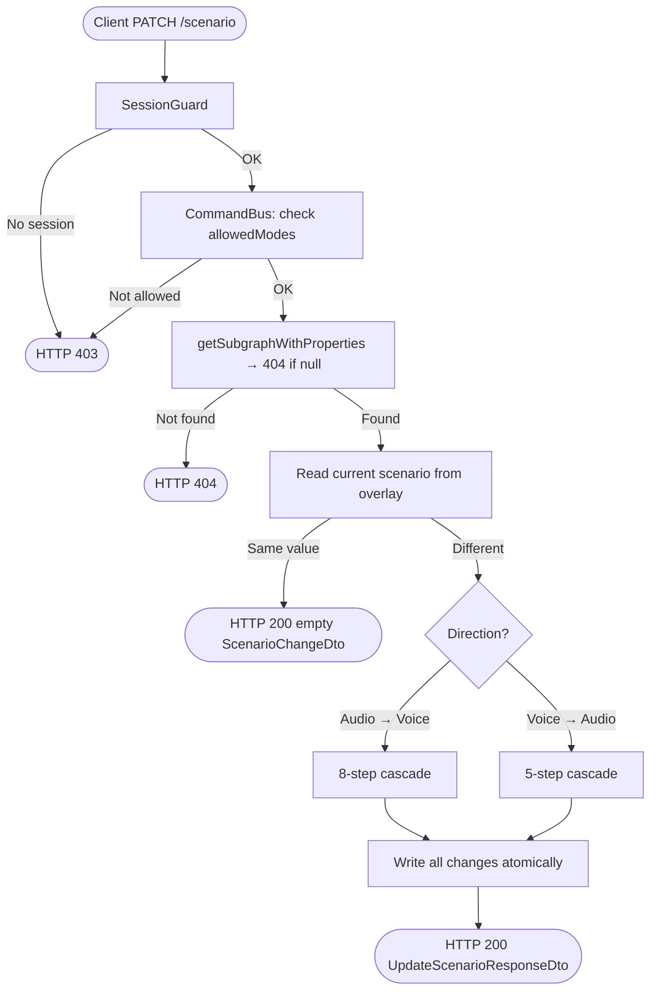

<!--
  Copyright (c) Qualcomm Technologies, Inc. and/or its subsidiaries.
  SPDX-License-Identifier: BSD-3-Clause
-->

# Set Subgraph Scenario — Low-Level Design (Draft)

**Feature folder:** `docs/property-data/`
**Status:** DRAFT — Ready for review
**Date:** 2026-08-27
**Related LLD:** `set-subgraph-property-design.md` (name, generic property, VSID)

---

## Requirements

Requirements source: [../set-subgraph-property-requirements.md](../set-subgraph-property-requirements.md)

| ID | Requirement |
|---|---|
| FR-SG-SCENARIO-01 | `PATCH /subgraphs/:id/scenario` — elements format, value is uint32 scenario ID as string |
| FR-SG-SCENARIO-02 | Subgraph existence → 404 |
| FR-SG-SCENARIO-03 | No-op if scenario already matches → 200 with empty mutation log |
| FR-SG-SCENARIO-04 | Audio → Voice cascade (8 steps, atomic) |
| FR-SG-SCENARIO-05 | Voice → Audio cascade (5 steps, atomic) |
| FR-SG-SCENARIO-06 | Returns `{ groupId, propertiesAdded, propertiesRemoved, moduleCkvsAdded, moduleCkvsDeleted }` |
| FR-CCR-01 | Active session required → 403 |
| FR-CCR-02 | DESIGNER / DIFF_MERGE modes only → 403 |
| FR-CCR-03/04 | All writes staged; visible via overlay read immediately |
| FR-CCR-05 | groupId in response |

---

## Section 0: Prerequisite — `serializeDefaultParameterData` in `serialize-elements.ts`

**Context:** This design calls `serializeDefaultParameterData` in four places:
- `addProperty` (§4.1) — seeds a new `SubgraphPropertyData` blob with default values
- `wipeCalData` (§4.4) — restores zero-CKV payload rows to factory defaults
- `addVcpmCfgDefaultData` (§4.6) — seeds new `VcpmParameterPayload` blobs
- Voice → Audio step c — seeds the clock scale factor property blob

That function does not yet exist in the codebase. The unmerged commit `a54340d` on `feature/use-case-designer` implements it. **This PR must port those changes before any of the above infra methods can be implemented.**

Full implementation details and the `build-subgraph-with-defaults.ts` wiring are documented in **`set-subgraph-property-design.md` Section 0** — that section is the authoritative source. The summary here is:

### 0.1 Files changed

| File | Change |
|---|---|
| `packages/core/src/application/usecase-designer/shared/serialize-elements.ts` | Add `serializeDefaultParameterData` + `buildDefaultElement` helpers (ported from commit `a54340d`) |
| `packages/core/src/application/usecase-designer/subgraph/build-subgraph-with-defaults.ts` | Replace `null` placeholder with `serializeDefaultParameterData(propDef)` |

See `set-subgraph-property-design.md §0.2–§0.3` for the full code.

---

## Section 1: Architecture & Call Flow

### 1.1 High-Level Workflow Diagram



### 1.2 File and Folder Organization

Files annotated **(existing)** already exist; **(modified)** means changed; **(new)** means new file.

#### Presentation Layer
```
packages/api/src/presentation/rest/modules/subgraph/
└── subgraph.controller.ts                                               (modified — implement setSubgraphScenario stub)
```

#### Core Shared
```
packages/core/src/application/usecase-designer/
├── shared/
│   └── serialize-elements.ts                                                (modified — add serializeDefaultParameterData + buildDefaultElement; see §0)
└── subgraph/
    └── build-subgraph-with-defaults.ts                                      (modified — replace null placeholder; see §0)
```

#### Core Layer
```
packages/core/src/application/
├── ports/persistence/query-services/vcpm-definition/
│   └── vcpm-definition-query-service.ts                                 (new — VcpmDefinitionQueryService port + VcpmModuleDefinitionWithParamsReadModel)
├── ports/persistence/query-services/
│   └── query-services.ts                                                (modified — add vcpmDefinitionQueryService: VcpmDefinitionQueryService)
├── ports/persistence/repositories/subgraph/
│   └── subgraph.repository.ts                                           (modified — add addProperty, removeProperty)
├── ports/persistence/repositories/module/
│   └── module.repository.ts                                             (modified — add wipeCalData, getModulesBySubgraphId)
├── orchestration/cqrs/registries/
│   └── command-handler-registry.ts                                      (modified — inject queryServices into UpdateSubgraphScenarioHandler)
└── usecase-designer/subgraph/
    ├── subgraph-property-ids/
    │   └── subgraph-property-ids.ts                                     (modified — add SUB_GRAPH_PROP_CLOCK_SCALE_FACTOR)
    ├── dto/
    │   └── subgraph-write-result-types.ts                               (modified — add groupId to ScenarioChangeDtoSchema)
    └── update-scenario/
        ├── update-subgraph-scenario.command.ts                          (modified — data: unknown[] → elements: ParameterElementSummaryDto[])
        └── update-subgraph-scenario.handler.ts                          (modified — implement full cascade logic)
```

#### Infrastructure Layer
```
packages/infrastructure/persistence/src/persistence-typeorm-sqllite/
├── queries/vcpm-definition/
│   └── db-vcpm-definition-query-service.ts                              (new — implements VcpmDefinitionQueryService)
├── repositories/subgraph/
│   └── subgraph.repository.ts                                           (modified — implement addProperty, removeProperty)
└── repositories/module/
    └── module.repository.ts                                             (modified — implement wipeCalData, getModulesBySubgraphId)
```

### 1.3 Layer Responsibilities

```
Presentation (API)
  PATCH /scenario:
    → @UseGuards(SessionGuard)
    → new UpdateSubgraphScenarioCommand(subgraphSystemId, dto.elements)
    → CommandBus.execute(command, session) — returns ScenarioChangeDto
    → toApiResult(Result.ok(result)) → UpdateScenarioResponseDto → 200

Core (Application)
  UpdateSubgraphScenarioHandler:
    fileSystemId = uow.getWriteContext().session.fileSystemId

    Read phase (no transaction):
      1. getSubgraphWithProperties(subgraphSystemId, fileSystemId) → 404 if null
      2. Resolve scenario property definition → get systemId
      3. Read current scenario value from subgraph properties
      4. No-op if current === requested → return empty ScenarioChangeDto
      5. If Audio → Voice: getOptimalVsid(subgraphSystemId, fileSystemId) → 422 if conflict
      6. Load all subgraph property definitions (for IsVoice filter + clock scale factor)

    Write phase (transactional — all steps share same groupId):
      uow.startTransaction()
      try:
        Audio → Voice (steps in order):
          a. addProperty for each IsVoice=true definition not already present
          b. removeProperty for SUB_GRAPH_PROP_CLOCK_SCALE_FACTOR if present
          c. setPropertyData for VSID property using BinaryDataWriter.writeUInt32(optimalVsid).align(8)
          d. wipeCalData for each module in subgraph
          e. for each VcpmModuleDefinition (via VcpmDefinitionQueryService):
               create VcpmInstance row + zero-CKV VcpmParameterPayload per parameter
               using serializeDefaultParameterData(paramDef) — from serialize-elements.ts (PR a54340d)
          f. setPropertyData for scenario property (final step)

        Voice → Audio (steps in order):
          a. wipeCalData for each module in subgraph
          b. removeProperty for each IsVoice=true property
          c. addProperty for SUB_GRAPH_PROP_CLOCK_SCALE_FACTOR with serializeDefaultParameterData(clockScaleDef)
          d. SubgraphRepository.removeAllVcpmCfgData (deletes VcpmInstance + VcpmCkv + VcpmParameterPayload)
          e. setPropertyData for scenario property (final step)
        uow.commit()
      catch:
        if uow.isInTransaction() → uow.rollback(); throw

      Return ScenarioChangeDto { groupId, propertiesAdded, propertiesRemoved,
                                  moduleCkvsAdded, moduleCkvsDeleted }

Infrastructure (Persistence)
  TypeOrmSubgraphRepository.addProperty:
    → writeCreate on SubgraphPropertyData row

  TypeOrmSubgraphRepository.removeProperty:
    → writeDelete on SubgraphPropertyData row

  TypeOrmModuleRepository.getModulesBySubgraphId:
    → loadBaselineNodeIdsForSubgraph(subgraphSystemId, fileSystemId) → Set<number>
    → applySessionOverlayToNodesForSubgraph(subgraphSystemId, nodeIds, sessionId)
    → fetchOverLayedSpfModules([...nodeIds], fileSystemId, sessionId)
    → returns SpfModuleBase[] (overlay-aware)

  TypeOrmModuleRepository.wipeCalData:
    → for each non-zero CKV: writeDelete on CkvParameterPayload rows + Ckv row
    → for each TKV: writeDelete on TkvParameterPayload rows + Tkv row
    → for each tagged module entry: writeDelete on ModuleTagIdMap row
    → for each existing zero-CKV payload row: writeDelta to restore default value
```

---

## Section 2: Presentation Layer

**File:** `packages/api/src/presentation/rest/modules/subgraph/subgraph.controller.ts` (modified)

The existing `setSubgraphScenario` stub already calls `UpdateSubgraphScenarioCommand` and maps `ScenarioChangeDto` to `UpdateScenarioResponseDto`. The command constructor is updated to accept `elements`:

```typescript
@Patch('/:subgraphSystemId/scenario')
@UseGuards(SessionGuard)
async setSubgraphScenario(
  @Param('subgraphSystemId', ParseIntPipe) subgraphSystemId: number,
  @Body() dto: UpdatePropertyRequestDto,
  @ArcSession() session: ActiveSession,
): Promise<ApiResult<UpdateScenarioResponseDto>> {
  const result = await this.commandBus.execute<ScenarioChangeDto>(
    new UpdateSubgraphScenarioCommand(subgraphSystemId, dto.elements),
    session,
  );
  return toApiResult(Result.ok(result));
}
```

**Note:** `ScenarioChangeDtoSchema` needs `groupId` added (see Section 3.1).

---

## Section 3: Core Layer

### 3.1 ScenarioChangeDtoSchema — add groupId

**File:** `packages/core/src/application/usecase-designer/subgraph/dto/subgraph-write-result-types.ts` (modified)

```typescript
export const ScenarioChangeDtoSchema = z.object({
  groupId: z.string(),
  propertiesAdded: z.array(PropertyChangeDtoSchema),
  propertiesRemoved: z.array(PropertyChangeDtoSchema),
  moduleCkvsAdded: z.array(CkvRefDtoSchema),
  moduleCkvsDeleted: z.array(CkvRefDtoSchema),
});
```

### 3.2 UpdateSubgraphScenarioCommand (modified)

**File:** `packages/core/src/application/usecase-designer/subgraph/update-scenario/update-subgraph-scenario.command.ts` (modified)

`data: unknown[]` → `elements: ParameterElementSummaryDto[]`:

```typescript
export class UpdateSubgraphScenarioCommand extends BaseCommand {
  static override readonly requiresSession = true;
  static override readonly allowedModes: readonly SessionMode[] = [
    SESSION_MODE.Designer,
    SESSION_MODE.DiffMerge,
  ];

  constructor(
    public readonly subgraphSystemId: number,
    public readonly elements: ParameterElementSummaryDto[],
  ) {
    super();
  }
}
```

### 3.3 Subgraph Property ID additions

**File:** `packages/core/src/application/usecase-designer/subgraph/subgraph-property-ids/subgraph-property-ids.ts` (modified)

Add:
```typescript
export const SUB_GRAPH_PROP_CLOCK_SCALE_FACTOR = 0x08001374;
```

### 3.4 UpdateSubgraphScenarioHandler

**File:** `packages/core/src/application/usecase-designer/subgraph/update-scenario/update-subgraph-scenario.handler.ts` (modified)

```typescript
export class UpdateSubgraphScenarioHandler implements CommandHandler<
  UpdateSubgraphScenarioCommand,
  ScenarioChangeDto
> {
  constructor(
    private readonly uow: UnitOfWork,
    private readonly queryServices: QueryServices,
  ) {}

  async handle(command: UpdateSubgraphScenarioCommand): Promise<ScenarioChangeDto> {
    const {session, groupId} = this.uow.getWriteContext();
    const fileSystemId = session.fileSystemId;

    // ── Read phase ────────────────────────────────────────────────────────────

    // Step 1: load subgraph with properties
    const subgraph = await this.uow.getSubgraphRepository()
      .getSubgraphWithProperties(command.subgraphSystemId, fileSystemId);
    if (!subgraph) {
      throw new ResourceNotFoundException(
        `Subgraph ${command.subgraphSystemId} not found`,
      );
    }

    // Step 2: resolve scenario property definition
    const scenarioDefResult = await this.queryServices.subgraphPropertyDefQueryService
      .getAllSubgraphPropertyDefinitionsSummary(fileSystemId, SUB_GRAPH_PROP_ID_SCENARIO_ID);
    if (scenarioDefResult.kind === RESULT_KIND.Fail || scenarioDefResult.data.length === 0) {
      throw new ResourceNotFoundException('Scenario property definition not found');
    }
    const scenarioDef = scenarioDefResult.data[0];

    // Step 3: read current scenario
    const scenarioProp = subgraph.properties.find(
      p => p.propertySystemId === scenarioDef.systemId,
    );
    const currentScenario = scenarioProp?.payload
      ? new BinaryDataReader(scenarioProp.payload as Uint8Array).readUInt32()
      : undefined;

    // Step 4: extract requested scenario from elements
    const requestedScenario = Number(command.elements[0]?.value);

    // Step 5: no-op if same
    if (currentScenario === requestedScenario) {
      return {
        groupId,
        propertiesAdded: [],
        propertiesRemoved: [],
        moduleCkvsAdded: [],
        moduleCkvsDeleted: [],
      };
    }

    // Step 6: determine direction
    const isAudioToVoice =
      currentScenario !== SUB_GRAPH_PROP_ID_SCENARIO_VALUE_VOICE_CALL &&
      requestedScenario === SUB_GRAPH_PROP_ID_SCENARIO_VALUE_VOICE_CALL;
    const isVoiceToAudio =
      currentScenario === SUB_GRAPH_PROP_ID_SCENARIO_VALUE_VOICE_CALL &&
      requestedScenario !== SUB_GRAPH_PROP_ID_SCENARIO_VALUE_VOICE_CALL;

    // Step 7: load all property definitions (needed for IsVoice filter + clock scale factor)
    const allDefsResult = await this.queryServices.subgraphPropertyDefQueryService
      .getAllDetailedSubgraphPropertyDefinitionsWithElements(fileSystemId);
    if (allDefsResult.kind === RESULT_KIND.Fail) {
      throw new Error('Failed to load subgraph property definitions');
    }
    const allDefs = allDefsResult.data;
    const voiceDefs = allDefs.filter(d => d.isVoice);
    const clockScaleDef = allDefs.find(d => d.propertyId === SUB_GRAPH_PROP_CLOCK_SCALE_FACTOR);

    // Step 8 (Audio → Voice only): find optimal VSID — throws 422 on conflict
    let optimalVsid: number | undefined;
    if (isAudioToVoice) {
      optimalVsid = await this.getOptimalVsid(command.subgraphSystemId, fileSystemId, allDefs);
    }

    // Step 9: get all non-deleted modules in this subgraph
    const modules = await this.uow.getModuleRepository()
      .getModulesBySubgraphId(command.subgraphSystemId, fileSystemId);

    // ── Serialize scenario payload (before transaction) ───────────────────────
    const scenarioDefWithElements = await this.queryServices.subgraphPropertyDefQueryService
      .getSubgraphPropertyDefinitionWithElements(scenarioDef.systemId, fileSystemId);
    if (scenarioDefWithElements.kind === RESULT_KIND.Fail) {
      throw new ResourceNotFoundException('Scenario property definition (with elements) not found');
    }
    const serializedScenario = serializeParameterData(
      scenarioDefWithElements.data, command.elements,
    );
    if (!serializedScenario.ok) {
      throw new BadRequestException(serializedScenario.error);
    }

    // ── Write phase (transactional) ───────────────────────────────────────────

    const propertiesAdded: z.infer<typeof PropertyChangeDtoSchema>[] = [];
    const propertiesRemoved: z.infer<typeof PropertyChangeDtoSchema>[] = [];
    const moduleCkvsAdded: z.infer<typeof CkvRefDtoSchema>[] = [];
    const moduleCkvsDeleted: z.infer<typeof CkvRefDtoSchema>[] = [];

    await this.uow.startTransaction();
    try {
      if (isAudioToVoice) {
        // a. Add voice-specific SPF properties (IsVoice=true, not already present)
        const existingPropIds = new Set(subgraph.properties.map(p => p.propertySystemId));
        for (const def of voiceDefs) {
          if (existingPropIds.has(def.systemId)) continue;
          const newSystemId = await this.uow.getSubgraphRepository()
            .addProperty(command.subgraphSystemId, def.systemId, def);
          propertiesAdded.push({systemId: String(newSystemId), propertyId: def.propertyId, propertyName: def.name});
        }

        // b. Remove clock scale factor if present
        if (clockScaleDef) {
          const clockProp = subgraph.properties.find(p => p.propertySystemId === clockScaleDef.systemId);
          if (clockProp) {
            await this.uow.getSubgraphRepository()
              .removeProperty(command.subgraphSystemId, clockProp.systemId);
            propertiesRemoved.push({systemId: String(clockProp.systemId), propertyId: clockScaleDef.propertyId, propertyName: clockScaleDef.name});
          }
        }

        // c. Set VSID using BinaryDataWriter directly (OQ-4)
        const vsidDefsResult = await this.queryServices.subgraphPropertyDefQueryService
          .getAllSubgraphPropertyDefinitionsSummary(fileSystemId, SUB_GRAPH_PROP_ID_VSID);
        const vsidDef = vsidDefsResult.data?.[0];
        if (vsidDef && optimalVsid !== undefined) {
          const writer = new BinaryDataWriter();
          writer.writeUInt32(optimalVsid);
          writer.align(8);
          await this.uow.getSubgraphRepository()
            .setPropertyData(command.subgraphSystemId, vsidDef.systemId, writer.toUint8Array());
        }

        // d. Wipe all module CKV/TKV cal data
        for (const mod of modules) {
          const wiped = await this.uow.getModuleRepository()
            .wipeCalData(mod.systemId, fileSystemId);
          moduleCkvsDeleted.push(...wiped.ckvsDeleted.map(c => ({
            moduleSystemId: String(mod.systemId), ckvSystemId: String(c),
          })));
          moduleCkvsAdded.push(...wiped.zeroCkvsAdded.map(c => ({
            moduleSystemId: String(mod.systemId), ckvSystemId: String(c),
          })));
        }

        // e. Add default VCPM cfg data for this subgraph
        const vcpmDefs = await this.queryServices.vcpmDefinitionQueryService
          .getVcpmModuleDefinitionsWithParams(fileSystemId);
        await this.uow.getSubgraphRepository()
          .addVcpmCfgDefaultData(command.subgraphSystemId, vcpmDefs);

      } else if (isVoiceToAudio) {
        // a. Wipe all module CKV/TKV cal data
        for (const mod of modules) {
          const wiped = await this.uow.getModuleRepository()
            .wipeCalData(mod.systemId, fileSystemId);
          moduleCkvsDeleted.push(...wiped.ckvsDeleted.map(c => ({
            moduleSystemId: String(mod.systemId), ckvSystemId: String(c),
          })));
          moduleCkvsAdded.push(...wiped.zeroCkvsAdded.map(c => ({
            moduleSystemId: String(mod.systemId), ckvSystemId: String(c),
          })));
        }

        // b. Remove voice-specific SPF properties
        for (const def of voiceDefs) {
          const voiceProp = subgraph.properties.find(p => p.propertySystemId === def.systemId);
          if (!voiceProp) continue;
          await this.uow.getSubgraphRepository()
            .removeProperty(command.subgraphSystemId, voiceProp.systemId);
          propertiesRemoved.push({systemId: String(voiceProp.systemId), propertyId: def.propertyId, propertyName: def.name});
        }

        // c. Add clock scale factor with default payload from elementsStructure defaultValue fields
        if (clockScaleDef) {
          const newSystemId = await this.uow.getSubgraphRepository()
            .addProperty(command.subgraphSystemId, clockScaleDef.systemId, clockScaleDef);
          propertiesAdded.push({systemId: String(newSystemId), propertyId: clockScaleDef.propertyId, propertyName: clockScaleDef.name});
        }

        // d. Remove all VCPM cfg data (VcpmInstance + children)
        await this.uow.getSubgraphRepository()
          .removeAllVcpmCfgData(command.subgraphSystemId);
      }

      // Final step (both directions): write scenario property
      await this.uow.getSubgraphRepository()
        .setPropertyData(command.subgraphSystemId, scenarioDef.systemId, serializedScenario.value);

      await this.uow.commit();
    } catch (error) {
      if (this.uow.isInTransaction()) await this.uow.rollback();
      throw error;
    }

    return {groupId, propertiesAdded, propertiesRemoved, moduleCkvsAdded, moduleCkvsDeleted};
  }

  private async getOptimalVsid(
    subgraphSystemId: number,
    fileSystemId: number,
    allDefs: SubgraphPropertyDefinitionWithElementsReadModel[],
  ): Promise<number> {
    const vsidDef = allDefs.find(d => d.propertyId === SUB_GRAPH_PROP_ID_VSID);
    if (!vsidDef) throw new ResourceNotFoundException('VSID property definition not found');

    const scenarioDef = allDefs.find(d => d.propertyId === SUB_GRAPH_PROP_ID_SCENARIO_ID);

    // BFS — same logic as UpdateSubgraphVsidHandler but read-only
    const processedIds = new Set<number>([subgraphSystemId]);
    const queue: number[] = [subgraphSystemId];
    const foundVsids = new Set<number>();

    while (queue.length > 0) {
      const currentId = queue.shift()!;
      const linkedIds = await this.uow.getSubgraphRepository()
        .getSubgraphIdsInSameUsecases(currentId, fileSystemId);

      for (const linkedId of linkedIds) {
        if (processedIds.has(linkedId)) continue;
        processedIds.add(linkedId);

        const linked = await this.uow.getSubgraphRepository()
          .getSubgraphWithProperties(linkedId, fileSystemId);
        if (!linked) continue;

        // Filter to Voice subgraphs only
        if (scenarioDef) {
          const scenarioProp = linked.properties.find(p => p.propertySystemId === scenarioDef.systemId);
          const scenarioVal = scenarioProp?.payload
            ? new BinaryDataReader(scenarioProp.payload as Uint8Array).readUInt32()
            : undefined;
          if (scenarioVal !== SUB_GRAPH_PROP_ID_SCENARIO_VALUE_VOICE_CALL) continue;
        }

        const vsidProp = linked.properties.find(p => p.propertySystemId === vsidDef.systemId);
        if (vsidProp?.payload) {
          foundVsids.add(new BinaryDataReader(vsidProp.payload as Uint8Array).readUInt32());
        }
        queue.push(linkedId);
      }
    }

    if (foundVsids.size === 0) {
      // No voice subgraphs found — use default from elementsStructure
      const schema = convertParamDefinition(vsidDef.elementsStructure);
      const firstConfig = schema.find(e => e.elementType === PARAMETER_ELEMENT_TYPE.ConfigElement) as ConfigElement | undefined;
      return Number(firstConfig?.defaultValue ?? '0');
    }

    if (foundVsids.size === 1) {
      return [...foundVsids][0];
    }

    // Multiple conflicting VSIDs → 422
    throw new DomainRuleViolationException(
      `Conflicting VSIDs found across linked usecases: ${[...foundVsids].join(', ')}`,
    );
  }
}
```

**Registry entry:**
```typescript
this.commandHandlerFactories.set(UpdateSubgraphScenarioCommand, {
  create: deps => new UpdateSubgraphScenarioHandler(deps.uow, deps.queryServices),
});
```

### 3.5 SubgraphRepository Port Extensions

**File:** `packages/core/src/application/ports/persistence/repositories/subgraph/subgraph.repository.ts` (modified)

Two new methods needed for adding and removing property rows (distinct from `setPropertyData` which updates an existing row):

```typescript
export interface SubgraphRepository {
  // ... existing methods from set-subgraph-property-design.md ...

  // Stages a CREATE for a new SubgraphPropertyData row with default payload.
  // Returns the new row's systemId (needed for mutation log).
  // definition is used to generate the default binary payload via serializeDefaultParameterData.
  addProperty(
    subgraphSystemId: number,
    propertyDefinitionSystemId: number,
    definition: SubgraphPropertyDefinitionWithElementsReadModel,
  ): Promise<number>;

  // Stages a DELETE on an existing SubgraphPropertyData row.
  // propDataSystemId is the PK of the SubgraphPropertyData row (not the definition systemId).
  removeProperty(
    subgraphSystemId: number,
    propDataSystemId: number,
  ): Promise<void>;

  // Stages DELETE for all VcpmInstance rows (and their VcpmCkv + VcpmParameterPayload +
  // VcpmCkvValues children) for the given subgraph. aggregateId = subgraphSystemId.
  // Used by Voice → Audio cascade step d.
  removeAllVcpmCfgData(subgraphSystemId: number): Promise<void>;

  // Stages CREATE for VcpmInstance + zero-CKV VcpmParameterPayload rows for each
  // VCPM module definition. Default payload derived from each parameter's elementsStructure
  // via serializeDefaultParameterData(param). Used by Audio → Voice cascade step e.
  addVcpmCfgDefaultData(
    subgraphSystemId: number,
    vcpmDefs: VcpmModuleDefinitionWithParamsReadModel[],
  ): Promise<void>;
}
```

### 3.6 ModuleRepository Port Extensions

**File:** `packages/core/src/application/ports/persistence/repositories/module/module.repository.ts` (modified)

```typescript
export interface WipeCalDataResult {
  ckvsDeleted: number[];      // systemIds of CKV rows staged for DELETE
  zeroCkvsAdded: number[];    // systemIds of zero-CKV rows staged for CREATE
}

export interface ModuleRepository {
  // ... existing methods ...

  // Returns all non-deleted SpfModule systemIds belonging to a subgraph.
  // Overlay-aware: excludes pending DELETE, includes pending CREATE.
  getModulesBySubgraphId(
    subgraphSystemId: number,
    fileSystemId: number,
  ): Promise<SpfModuleBase[]>;

  // Wipes all CKV/TKV cal data for a module:
  //   - Stages DELETE for all non-zero CKV rows and their parameter payloads
  //   - Stages DELETE for all TKV rows and their parameter payloads
  //   - Stages DELETE for all tagged module entries
  //   - Stages CREATE for zero-CKV default payload rows for each calibration parameter
  // Returns mutation log for ScenarioChangeDto.
  wipeCalData(
    moduleSystemId: number,
    fileSystemId: number,
  ): Promise<WipeCalDataResult>;
}
```

---

## Section 4: Infrastructure Layer

### 4.1 TypeOrmSubgraphRepository — addProperty

```typescript
async addProperty(
  subgraphSystemId: number,
  propertyDefinitionSystemId: number,
  definition: SubgraphPropertyDefinitionWithElementsReadModel,
): Promise<number> {
  const {session, groupId} = this.uow.getWriteContext();
  const newSystemId = await this.idGeneration.generateId(ENTITY_NAMES.SubgraphPropertyData);
  // Default payload derived from each ConfigElement's defaultValue via serializeDefaultParameterData.
  const defaultPayload = serializeDefaultParameterData(definition); // definition: ParameterDefinitionBase
  await this.writer.writeCreate(
    {
      targetTable:    ENTITY_NAMES.SubgraphPropertyData,
      targetSystemId: newSystemId,
      aggregateId:    subgraphSystemId,
      payload: {
        subgraphSystemId,
        subgraphPropertySystemId: propertyDefinitionSystemId,
        payload: defaultPayload,
      },
    },
    session.sessionId,
    groupId,
    this.manager,
  );
  return newSystemId;
}
```

**Note:** `addProperty` requires `IdGenerationPort` — the repository constructor must gain this dependency, same pattern as `CreateModuleHandler`.

### 4.2 TypeOrmSubgraphRepository — removeProperty

```typescript
async removeProperty(
  subgraphSystemId: number,
  propDataSystemId: number,
): Promise<void> {
  const {session, groupId} = this.uow.getWriteContext();
  await this.writer.writeDelete(
    {
      targetTable:    ENTITY_NAMES.SubgraphPropertyData,
      targetSystemId: propDataSystemId,
      aggregateId:    subgraphSystemId,
    },
    session.sessionId,
    groupId,
    this.manager,
  );
}
```

### 4.3 TypeOrmModuleRepository — getModulesBySubgraphId

Uses the two-step pattern on `ModuleNodeOverlayFetcher` — `loadBaselineNodeIdsForSubgraph`
then `applySessionOverlayToNodesForSubgraph` then `fetchOverLayedSpfModules`:

```typescript
async getModulesBySubgraphId(
  subgraphSystemId: number,
  fileSystemId: number,
): Promise<SpfModuleBase[]> {
  const {session} = this.uow.getWriteContext();
  const sessionId = session.sessionId;

  // Step 1: get baseline module node IDs for this subgraph
  const nodeIds = await this.moduleNodeFetcher.loadBaselineNodeIdsForSubgraph(
    subgraphSystemId,
    fileSystemId,
  );

  // Step 2: apply session overlay (adds staged CREATEs, removes staged DELETEs)
  await this.moduleNodeFetcher.applySessionOverlayToNodesForSubgraph(
    subgraphSystemId,
    nodeIds,
    sessionId,
  );

  if (nodeIds.size === 0) return [];

  // Step 3: fetch full overlay-aware SpfModule rows for the resolved IDs
  const rows = await this.moduleNodeFetcher.fetchOverLayedSpfModules(
    [...nodeIds],
    fileSystemId,
    sessionId,
  );

  return rows.map(r => ({
    systemId: r.systemId,
    definitionSystemId: r.definitionSystemId,
    subgraphSystemId: r.subgraphSystemId,
    containerSystemId: r.containerSystemId,
  }));
}
```

### 4.4 TypeOrmModuleRepository — wipeCalData

This is the most complex infra method. It mirrors `RemoveAllGeckoCalTagData` + `AddZeroCkvData` from the C# reference.

**Steps:**
1. Load all CKVs for the module (overlay-aware) via `CkvOverlayFetcher.fetchForModule`
2. For each **non-zero** CKV (those whose `values` array is non-empty): stage DELETE on all its `CkvParameterPayload` rows, then DELETE the CKV row itself
3. Load all `ModuleTagIdMap` rows for the module via `TkvOverlayFetcher.fetchForModule` — for each: DELETE its `TkvParameterPayload` rows, `Tkv` rows, then the `ModuleTagIdMap` row
4. Find the zero-CKV (the one whose `values` array is empty) — for each of its existing `CkvParameterPayload` rows: fetch its definition and write delta to restore default value

```typescript
async wipeCalData(
  moduleSystemId: number,
  fileSystemId: number,
): Promise<WipeCalDataResult> {
  const {session, groupId} = this.uow.getWriteContext();
  const ckvsDeleted: number[] = [];
  const zeroCkvsAdded: number[] = [];

  // Step 1+2: load CKVs, delete non-zero CKVs and their payloads
  const ckvs = await this.ckvOverlayFetcher.fetchForModule(moduleSystemId, session.sessionId);
  for (const ckv of ckvs) {
    if (ckv.values.length === 0) continue; // skip zero-CKV (no key-value entries)
    const payloads = await this.ckvOverlayFetcher.fetchCkvPayloads(
      ckv.systemId, moduleSystemId, session.sessionId,
    );
    for (const payload of payloads) {
      await this.writer.writeDelete(
        {targetTable: ENTITY_NAMES.CkvParameterPayload, targetSystemId: payload.systemId, aggregateId: moduleSystemId},
        session.sessionId, groupId, this.manager,
      );
    }
    await this.writer.writeDelete(
      {targetTable: ENTITY_NAMES.Ckv, targetSystemId: ckv.systemId, aggregateId: moduleSystemId},
      session.sessionId, groupId, this.manager,
    );
    ckvsDeleted.push(ckv.systemId);
  }

  // Step 3+4: load ModuleTagIdMap + TKVs, delete TkvParameterPayload, Tkv, ModuleTagIdMap
  // CkvValues and TkvValues are composite-PK join tables — cascade DELETE automatically.
  const tagMaps = await this.tkvOverlayFetcher.fetchForModule(
    moduleSystemId, session.sessionId, CONFIGURATION_INCLUDES.FullDetails,
  );
  for (const tagMap of tagMaps) {
    for (const tkv of tagMap.tkvs) {
      const tkvPayloads = await this.tkvOverlayFetcher.fetchTkvPayloads(
        tkv.systemId, session.sessionId,
      );
      for (const payload of tkvPayloads) {
        await this.writer.writeDelete(
          {targetTable: ENTITY_NAMES.TkvParameterPayload, targetSystemId: payload.systemId, aggregateId: tagMap.systemId},
          session.sessionId, groupId, this.manager,
        );
      }
      await this.writer.writeDelete(
        {targetTable: ENTITY_NAMES.Tkv, targetSystemId: tkv.systemId, aggregateId: tagMap.systemId},
        session.sessionId, groupId, this.manager,
      );
    }
    await this.writer.writeDelete(
      {targetTable: ENTITY_NAMES.ModuleTagIdMap, targetSystemId: tagMap.systemId, aggregateId: moduleSystemId},
      session.sessionId, groupId, this.manager,
    );
  }

  // Step 5: restore zero-CKV default payloads.
  // When switching Audio → Voice, the zero-CKV's user-edited payloads must be
  // reset to factory defaults. Existing payload rows are already under the zero-CKV
  // (created at module creation) — we just overwrite each one with its default value.
  const zeroCkv = ckvs.find(c => c.values.length === 0);
  if (zeroCkv) {
    const module = await this.moduleNodeFetcher.fetchOne(moduleSystemId, fileSystemId, session.sessionId);
    if (module) {
      const existingPayloads = await this.ckvOverlayFetcher.fetchCkvPayloads(
        zeroCkv.systemId, moduleSystemId, session.sessionId,
      );
      for (const payload of existingPayloads) {
        const defs = await this.uow.getModuleDefinitionRepository()
          .getParameterDefinitions(module.definitionSystemId, [payload.parameterSystemId]);
        if (defs.length === 0) continue;
        const defaultPayload = serializeDefaultParameterData(defs[0]);
        await this.writer.writeDelta(
          {targetTable: ENTITY_NAMES.CkvParameterPayload, targetSystemId: payload.systemId,
           aggregateId: moduleSystemId, delta: {payload: defaultPayload}},
          session.sessionId, groupId, this.manager,
        );
        zeroCkvsAdded.push(zeroCkv.systemId);
      }
    }
  }

  return {ckvsDeleted, zeroCkvsAdded};
}
```

**Constructor note:** `TypeOrmModuleRepository` must be extended with `TkvOverlayFetcher` for `wipeCalData`. Add it alongside the existing `CkvOverlayFetcher` in the constructor:
```typescript
this.tkvOverlayFetcher = new TkvOverlayFetcher(manager, editActionsQs);
```

---

### 4.5 TypeOrmSubgraphRepository — removeAllVcpmCfgData

```typescript
async removeAllVcpmCfgData(subgraphSystemId: number): Promise<void> {
  const {session, groupId} = this.uow.getWriteContext();

  // Load all VcpmInstance rows for this subgraph
  const instances = await this.manager
    .getRepository(ENTITY_NAMES.VcpmInstance)
    .createQueryBuilder('vi')
    .leftJoinAndSelect('vi.vcpmCkvs', 'ckv')
    .leftJoinAndSelect('ckv.vcpmParameterPayloads', 'payload')
    .where('vi.subgraphSystemId = :subgraphSystemId', {subgraphSystemId})
    .getMany();

  for (const instance of instances) {
    for (const ckv of instance.vcpmCkvs ?? []) {
      for (const payload of ckv.vcpmParameterPayloads ?? []) {
        await this.writer.writeDelete(
          {targetTable: ENTITY_NAMES.VcpmParameterPayload, targetSystemId: payload.systemId, aggregateId: subgraphSystemId},
          session.sessionId, groupId, this.manager,
        );
      }
      await this.writer.writeDelete(
        {targetTable: ENTITY_NAMES.VcpmCkv, targetSystemId: ckv.systemId, aggregateId: subgraphSystemId},
        session.sessionId, groupId, this.manager,
      );
    }
    await this.writer.writeDelete(
      {targetTable: ENTITY_NAMES.VcpmInstance, targetSystemId: instance.systemId, aggregateId: subgraphSystemId},
      session.sessionId, groupId, this.manager,
    );
  }
}
```

### 4.6 TypeOrmSubgraphRepository — addVcpmCfgDefaultData

```typescript
async addVcpmCfgDefaultData(
  subgraphSystemId: number,
  vcpmDefs: VcpmModuleDefinitionWithParamsReadModel[],
): Promise<void> {
  const {session, groupId} = this.uow.getWriteContext();

  for (const def of vcpmDefs) {
    // Create VcpmInstance row linking this subgraph to the VCPM module definition
    const instanceSystemId = await this.idGeneration.generateId(ENTITY_NAMES.VcpmInstance);
    await this.writer.writeCreate(
      {
        targetTable: ENTITY_NAMES.VcpmInstance,
        targetSystemId: instanceSystemId,
        aggregateId: subgraphSystemId,
        payload: {subgraphSystemId, vcpmDefinitionId: def.systemId},
      },
      session.sessionId, groupId, this.manager,
    );

    // Create zero-CKV VcpmCkv row (no VcpmCkvValues — zero-CKV has empty key set)
    const ckvSystemId = await this.idGeneration.generateId(ENTITY_NAMES.VcpmCkv);
    await this.writer.writeCreate(
      {
        targetTable: ENTITY_NAMES.VcpmCkv,
        targetSystemId: ckvSystemId,
        aggregateId: subgraphSystemId,
        payload: {vcpmInstanceSystemId: instanceSystemId},
      },
      session.sessionId, groupId, this.manager,
    );

    // Create VcpmParameterPayload for each parameter using default values
    for (const param of def.parameters) {
      const defaultPayload = serializeDefaultParameterData(param);
      const payloadSystemId = await this.idGeneration.generateId(ENTITY_NAMES.VcpmParameterPayload);
      await this.writer.writeCreate(
        {
          targetTable: ENTITY_NAMES.VcpmParameterPayload,
          targetSystemId: payloadSystemId,
          aggregateId: subgraphSystemId,
          payload: {vcpmCkvSystemId: ckvSystemId, vcpmParameterSystemId: param.systemId, payload: defaultPayload},
        },
        session.sessionId, groupId, this.manager,
      );
    }
  }
}
```

---

## Section 5: Testing Strategy

### Unit Tests

#### serializeDefaultParameterData + buildSubgraphWithDefaults

> Covered by `set-subgraph-property-design.md §5` — tests live in:
> - `packages/core/tests/unit/application/usecase-designer/shared/serialize-default-parameter-data.spec.ts`
> - `packages/core/tests/unit/application/usecase-designer/subgraph/build-subgraph-with-defaults.spec.ts`

#### UpdateSubgraphScenarioHandler

**File:** `packages/core/tests/unit/application/usecase-designer/subgraph/update-scenario/update-subgraph-scenario.handler.spec.ts` (new)

| Scenario | Expected outcome |
|---|---|
| Subgraph not found | throws `ResourceNotFoundException` → 404 |
| Scenario definition not found | throws `ResourceNotFoundException` → 404 |
| Current === requested (no-op) | returns empty `ScenarioChangeDto`; no writes |
| Audio → Voice: VSID conflict | throws `DomainRuleViolationException` → 422 |
| Audio → Voice: success | voice props added, clock scale removed, VSID set, CKVs wiped, VCPM cfg added, scenario written |
| Voice → Audio: success | CKVs wiped, voice props removed, clock scale added, VCPM cfg removed, scenario written |
| Write throws | `rollback()` called; error re-thrown |
| Serialization of scenario payload fails | throws `BadRequestException` → 400 |

### Integration Tests

**File:** `packages/infrastructure/persistence/tests/integration/repositories/subgraph/subgraph-scenario.repository.spec.ts` (new)

| Scenario | Expected outcome |
|---|---|
| `addProperty` — writes CREATE on SubgraphPropertyData | `edit_actions` row with correct payload |
| `removeProperty` — writes DELETE on SubgraphPropertyData | `edit_actions` DELETE row |
| `getModulesBySubgraphId` — base rows | returns correct SpfModuleBase[] |
| `getModulesBySubgraphId` — pending DELETE overlay | excludes deleted module |
| `getModulesBySubgraphId` — pending CREATE overlay | includes staged module |
| `wipeCalData` — non-zero CKVs deleted | DELETE edit_actions for each CKV + payloads |
| `wipeCalData` — zero-CKV skipped | zero-CKV row NOT deleted |
| `wipeCalData` — zero-CKV defaults created | CREATE edit_actions for default payloads |

### End-to-End Tests

**File:** `packages/api/tests/e2e/subgraph/set-subgraph-scenario.e2e-spec.ts` (new)

| Scenario | HTTP status |
|---|---|
| No active session | 403 |
| Session mode TUNING | 403 |
| Subgraph not found | 404 |
| Same scenario (no-op) | 200 empty mutation log |
| Audio → Voice: VSID conflict | 422 |
| Audio → Voice: success | 200 with populated `propertiesAdded`, `moduleCkvsDeleted`, `moduleCkvsAdded` |
| Voice → Audio: success | 200 with populated `propertiesRemoved`, `moduleCkvsDeleted`, `moduleCkvsAdded` |

---

## Open Questions

| # | Question |
|---|---|
| OQ-1 | ~~VCPM cfg definition source~~ — **Resolved:** All rows in `vcpm_module_definitions` for a given `fileSystemId` are VCPM cfg definitions — no filtering needed. Add a new `VcpmDefinitionQueryService` port with one method: `getVcpmModuleDefinitionsWithParams(fileSystemId): Promise<VcpmModuleDefinitionWithParamsReadModel[]>`. Read model: `{ systemId, moduleDefinitionId, parameters: { systemId, paramId, elementsStructure }[] }`. Infra: simple SQL join of `vcpm_module_definitions` + `vcpm_module_parameter_definitions` filtered by `fileSystemId`. Audio→Voice step e uses this to create one `VcpmInstance` row per definition and one zero-CKV `VcpmParameterPayload` per parameter with default payload derived from `elementsStructure`. |
| OQ-2 | ~~Remove all VCPM cfg data~~ — **Resolved:** VCPM data is owned by the subgraph aggregate (`aggregateId = subgraphSystemId`). Add `removeAllVcpmCfgData(subgraphSystemId: number): Promise<void>` to `SubgraphRepository`. Infra: query all `VcpmInstance` WHERE `subgraphSystemId = X`; for each instance → for each `VcpmCkv` → stage DELETE on `VcpmParameterPayload` rows, `VcpmCkvValues` rows, the `VcpmCkv` row; then stage DELETE on the `VcpmInstance` row. Distinct from the existing `delete-vcpm-ckv` handler which deletes a single CKV entry. |
| OQ-3 | ~~`SUB_GRAPH_PROP_CLOCK_SCALE_FACTOR` property ID~~ — **Resolved:** `SUB_GRAPH_PROP_CLOCK_SCALE_FACTOR = 0x08001374`. |
| OQ-4 | ~~VSID payload construction inside cascade~~ — **Resolved:** Use `BinaryDataWriter` directly. `const writer = new BinaryDataWriter(); writer.writeUInt32(optimalVsid); writer.align(8); const payload = writer.toUint8Array();`. No need to go through `serializeParameterData` since the value is a computed `number`, not user-supplied `elements`. |
| OQ-5 | ~~Default payload for `addProperty`~~ — **Resolved:** Use `serializeDefaultParameterData(definition)` from `packages/core/src/application/usecase-designer/shared/serialize-elements.ts` (added in PR a54340d). It builds default `ElementData[]` from each `ConfigElement.defaultValue ?? '0'` then calls `serializeParameterData` internally. The `definition` is a `ParameterDefinitionBase` object (already available at all call sites). No new file required. |
| OQ-6 | ~~`getOptimalVsid` implementation~~ — **Resolved:** Private method on `UpdateSubgraphScenarioHandler`. Uses `getSubgraphIdsInSameUsecases` (already designed) for BFS, `getSubgraphWithProperties` to read each linked subgraph's scenario + VSID, filters to Voice only. If no voice subgraphs found: parse `vsidDef.elementsStructure` via `convertParamDefinition`, read `defaultValue` from the first `ConfigElement`, return `Number(defaultValue)`. If one distinct VSID found: use it. If multiple distinct VSIDs found: throw `DomainRuleViolationException` → 422. No shared service needed — `UpdateSubgraphVsidHandler` does not call this. |
| OQ-7 | ~~TKV and tagged module wipe~~ — **Resolved:** Full hierarchy per module: `ModuleTagIdMap` (tagged entries, `aggregateId=spfModuleSystemId`) → `Tkv` (`aggregateId=moduleTagIdMapSystemId`) → `TkvParameterPayload`. `TkvValues` and `CkvValues` are composite-PK join tables — they cascade DELETE automatically when their parent is deleted, no explicit write needed. Fetchers already exist: `CkvOverlayFetcher` for CKV reads, `TkvOverlayFetcher` for `ModuleTagIdMap` + TKV reads. `wipeCalData` infra steps: (1) fetch all CKVs via `CkvOverlayFetcher`, skip zero-CKV, DELETE payloads + CKV rows; (2) fetch all `ModuleTagIdMap` via `TkvOverlayFetcher`, DELETE `TkvParameterPayload` + `Tkv` + `ModuleTagIdMap` rows. All writes use `aggregateId = spfModuleSystemId` for CKV level and `aggregateId = moduleTagIdMapSystemId` for TKV level. |
| OQ-8 | ~~Zero-CKV default payload source for `wipeCalData`~~ — **Resolved:** The zero-CKV row (empty `CkvValues`) always exists — `wipeCalData` only deletes non-zero CKVs, so the zero-CKV survives. Step 5 resets each existing `CkvParameterPayload` row under the zero-CKV back to its factory default. No tool-policy filter needed — every payload row that exists under the zero-CKV was created at module creation and must be reset. Steps: (1) `ckvOverlayFetcher.fetchCkvPayloads(zeroCkv.systemId, moduleSystemId, sessionId)` → existing rows; (2) for each: `getModuleDefinitionRepository().getParameterDefinitions(moduleDefSystemId, [payload.parameterSystemId])` to get the definition; (3) `serializeDefaultParameterData(def)` → `writeDelta` on the existing payload row. |
