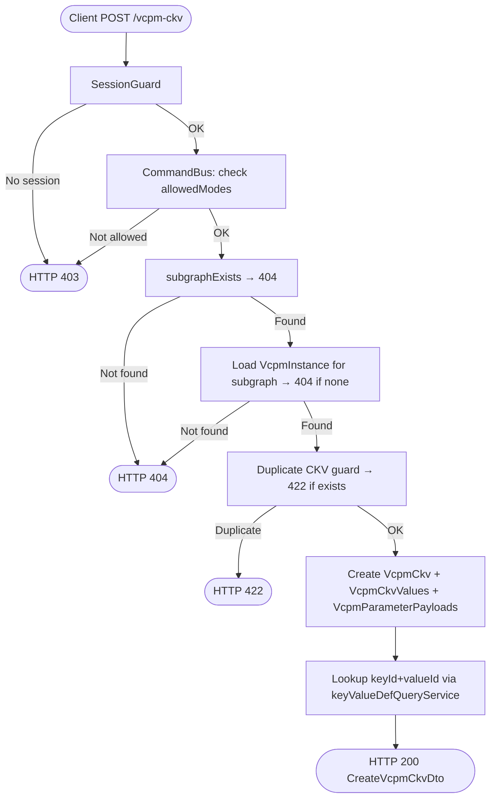
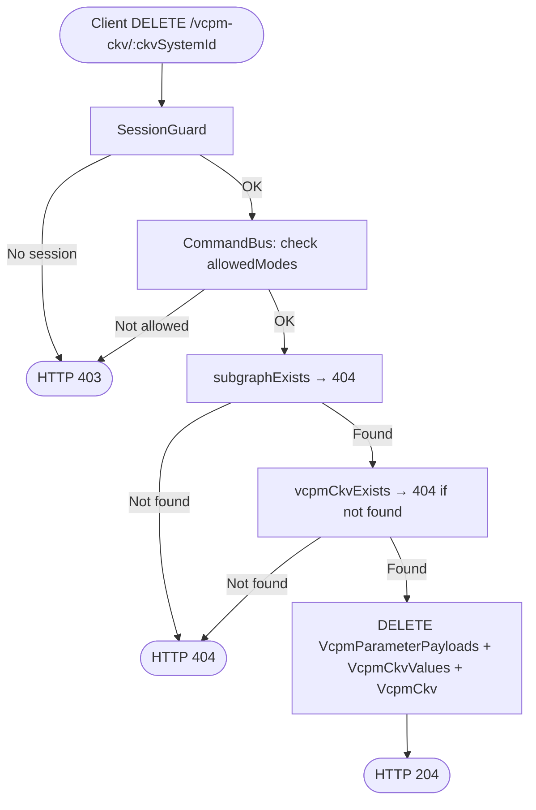
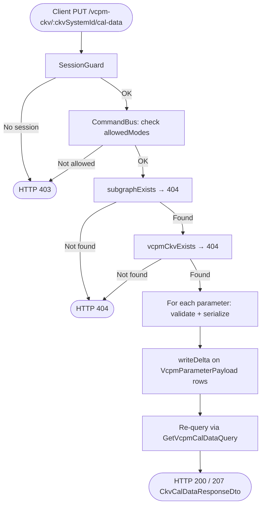

<!--
  Copyright (c) Qualcomm Technologies, Inc. and/or its subsidiaries.
  SPDX-License-Identifier: BSD-3-Clause
-->

# Set Subgraph VCPM CKV — Low-Level Design (Draft)

**Feature folder:** `docs/property-data/`
**Status:** DRAFT — Ready for review
**Date:** 2026-08-28
**Related LLD:** `set-subgraph-scenario-design.md` (introduces `VcpmDefinitionQueryService`)

---

## Requirements

Requirements source: [../set-subgraph-vcpm-ckv-requirements.md](../set-subgraph-vcpm-ckv-requirements.md)

| ID | Requirement |
|---|---|
| FR#5 | `POST /subgraphs/:id/vcpm-ckv` — create a new CKV entry with default payloads for all parameters |
| FR#6 | `DELETE /subgraphs/:id/vcpm-ckv/:ckvSystemId` — delete a CKV and all its parameter payloads |
| FR#7 | `PUT /subgraphs/:id/vcpm-ckv/:ckvSystemId/cal-data` — update cal payloads for one or more parameters; partial success supported |
| FR-CCR-01 | Active session required → 403 |
| FR-CCR-02 | DESIGNER / DIFF_MERGE modes only → 403 |
| FR-CCR-03/04 | All writes staged; visible via overlay read immediately |
| FR-CCR-05 | groupId in all responses |

---

## Section 1: Architecture & Call Flow

All three endpoints follow hexagonal + CQRS. Commands and handlers are already stubbed — this LLD implements them.

### 1.1 High-Level Workflow Diagrams

#### POST /vcpm-ckv



#### DELETE /vcpm-ckv/:ckvSystemId



#### PUT /vcpm-ckv/:ckvSystemId/cal-data



### 1.2 File and Folder Organization

Files annotated **(existing)** already exist; **(modified)** means changed; **(new)** means new file.

#### Presentation Layer
```
packages/api/src/presentation/rest/modules/subgraph/
└── subgraph.controller.ts                                               (modified — implement createVcpmCkv, deleteVcpmCkv, updateVcpmCalData stubs)
```

#### Core Layer
```
packages/core/src/application/
├── ports/persistence/repositories/subgraph/
│   └── subgraph.repository.ts                                           (modified — add createVcpmCkv, vcpmCkvExists, deleteVcpmCkv, getVcpmCkvPayloads, updateVcpmCalData)
├── orchestration/cqrs/registries/
│   └── command-handler-registry.ts                                      (modified — inject queryServices into CreateVcpmCkvHandler and UpdateVcpmCalDataHandler)
└── usecase-designer/subgraph/
    ├── create-vcpm-ckv/
    │   └── create-vcpm-ckv.handler.ts                                   (modified — implement logic)
    ├── delete-vcpm-ckv/
    │   └── delete-vcpm-ckv.handler.ts                                   (modified — implement logic)
    └── update-vcpm-cal-data/
        ├── update-vcpm-cal-data.command.ts                              (modified — data: unknown[] → parameters: Array<{systemId, elements}>)
        ├── update-vcpm-cal-data.handler.ts                              (modified — implement logic)
        └── put-vcpm-cal-data-result.ts                                  (new — PutVcpmCalDataResult interface)
```

#### Infrastructure Layer
```
packages/infrastructure/persistence/src/persistence-typeorm-sqllite/
└── repositories/subgraph/
    └── subgraph.repository.ts                                           (modified — implement createVcpmCkv, vcpmCkvExists, deleteVcpmCkv, getVcpmCkvPayloads, updateVcpmCalData)
```

No schema changes — no migration needed.

### 1.3 Layer Responsibilities

```
Presentation (API)
  POST /vcpm-ckv:
    → new CreateVcpmCkvCommand(subgraphSystemId, dto.ckv)
    → CommandBus.execute → CreateVcpmCkvDto
    → toApiResult(Result.ok(result)) → 200

  DELETE /vcpm-ckv/:ckvSystemId:
    → new DeleteVcpmCkvCommand(subgraphSystemId, ckvSystemId)
    → CommandBus.execute → void → 204

  PUT /vcpm-ckv/:ckvSystemId/cal-data:
    → new UpdateVcpmCalDataCommand(subgraphSystemId, ckvSystemId, dto.parameters)
    → CommandBus.execute → PutVcpmCalDataResult
    → re-query via GetVcpmCalDataQuery (succeeded params only)
    → assemble ApiResult<CkvCalDataDto> → 200 / 207

Core (Application)
  CreateVcpmCkvHandler:
    1. subgraphExists → 404
    2. Load VcpmInstance for subgraph via VcpmDefinitionQueryService → 404 if none
    3. Duplicate guard: vcpmCkvExists(instanceSystemId, valueSystemIds) → 422
    4. createVcpmCkv(subgraphSystemId, instanceSystemId, valueSystemIds, paramDefs)
    5. Lookup keyId+valueId via keyValueDefQueryService.getKeyValueSummaryForGivenValues
    6. Return CreateVcpmCkvDto { groupId, ckvSystemId, ckv: [{keyId, valueId}] }

  DeleteVcpmCkvHandler:
    1. subgraphExists → 404
    2. vcpmCkvExistsBySystemId(ckvSystemId, subgraphSystemId) → 404
    3. deleteVcpmCkv(subgraphSystemId, ckvSystemId) — deletes payloads + values + ckv row
    4. Return void

  UpdateVcpmCalDataHandler:
    1. subgraphExists → 404
    2. vcpmCkvExistsBySystemId(ckvSystemId, subgraphSystemId) → 404
    3. getVcpmCkvPayloads(ckvSystemId, subgraphSystemId) → existing payload rows (overlay-aware)
    4. Load VcpmModuleParameterDefinition for each payload via VcpmDefinitionQueryService
    5. For each submitted parameter:
         - no existing payload → per-parameter failure (update-only)
         - isReadOnly → per-parameter failure
         - serializeParameterData → per-parameter failure if fails
    6. updateVcpmCalData(subgraphSystemId, ckvSystemId, payloadUpdates)
    7. Return PutVcpmCalDataResult { groupId, succeededParamSystemIds }

Infrastructure (Persistence)
  createVcpmCkv:
    → writeCreate VcpmCkv row (aggregateId = subgraphSystemId)
    → writeCreate VcpmCkvValues rows (one per valueSystemId)
    → writeCreate VcpmParameterPayload rows (one per param, default payload)

  deleteVcpmCkv:
    → fetch existing VcpmParameterPayload rows for ckvSystemId
    → writeDelete each VcpmParameterPayload (aggregateId = subgraphSystemId)
    → writeDelete VcpmCkv row (aggregateId = subgraphSystemId)
    (VcpmCkvValues cascade via DB ON DELETE CASCADE)

  updateVcpmCalData:
    → writeDelta on each VcpmParameterPayload (aggregateId = subgraphSystemId,
      delta = { payload: serializedBytes })
```

---

## Section 2: Presentation Layer

**File:** `packages/api/src/presentation/rest/modules/subgraph/subgraph.controller.ts` (modified)

### 2.1 POST /vcpm-ckv

The existing `createVcpmCkv` stub is already wired correctly — only the handler needs implementation. No controller changes needed.

### 2.2 DELETE /vcpm-ckv/:ckvSystemId

The existing `deleteVcpmCkv` stub is already wired correctly — no controller changes needed.

### 2.3 PUT /vcpm-ckv/:ckvSystemId/cal-data

The existing `updateVcpmCalData` stub uses `UpdatePropertyRequestDto` (single property elements). This must be updated to accept `UpdateSpfModuleCalDataRequest` (list of parameters with systemIds) — same DTO as the SPF module PUT cal-data endpoint:

```typescript
@Put('/:subgraphSystemId/vcpm-ckv/:ckvSystemId/cal-data')
@UseGuards(SessionGuard)
async updateVcpmCalData(
  @Param('projectId') projectId: string,
  @Param('subgraphSystemId', ParseIntPipe) subgraphSystemId: number,
  @Param('ckvSystemId', ParseIntPipe) ckvSystemId: number,
  @Body() dto: UpdateSpfModuleCalDataRequest,
  @ArcSession() session: ActiveSession,
): Promise<ApiResult<CkvCalDataResponseDto>> {
  const putResult = await this.commandBus.execute<Result<PutVcpmCalDataResult>>(
    new UpdateVcpmCalDataCommand(subgraphSystemId, ckvSystemId, dto.parameters),
    session,
  );
  if (putResult.kind === RESULT_KIND.Fail) throw new Error('Unexpected Fail');

  let data: CkvCalDataDto | undefined;
  if (putResult.data.succeededParamSystemIds.length > 0) {
    const query = new GetVcpmCalDataQuery(
      projectId, String(subgraphSystemId), String(ckvSystemId), 'api-client',
      putResult.data.succeededParamSystemIds.join(','),
    );
    const readResult = await this.queryBus.execute<Result<CkvCalDataDto>>(query);
    data = readResult.kind !== RESULT_KIND.Fail ? readResult.data : undefined;
  }

  const issues = putResult.issues ?? [];
  const resultEnvelope = issues.length > 0 ? Result.partial(data, issues) : Result.ok(data);
  return toApiResult(resultEnvelope);
}
```

---

## Section 3: Core Layer

### 3.1 UpdateVcpmCalDataCommand (modified)

**File:** `packages/core/src/application/usecase-designer/subgraph/update-vcpm-cal-data/update-vcpm-cal-data.command.ts` (modified)

`data: unknown[]` → `parameters: Array<{ systemId: number; elements: ParameterElementSummaryDto[] }>`:

```typescript
export class UpdateVcpmCalDataCommand extends BaseCommand {
  static override readonly requiresSession = true;
  static override readonly allowedModes: readonly SessionMode[] = [
    SESSION_MODE.Designer,
    SESSION_MODE.DiffMerge,
  ];

  constructor(
    public readonly subgraphSystemId: number,
    public readonly ckvSystemId: number,
    public readonly parameters: Array<{systemId: number; elements: ParameterElementSummaryDto[]}>,
  ) {
    super();
  }
}
```

### 3.2 CreateVcpmCkvHandler

**File:** `packages/core/src/application/usecase-designer/subgraph/create-vcpm-ckv/create-vcpm-ckv.handler.ts` (modified)

```typescript
export class CreateVcpmCkvHandler implements CommandHandler<
  CreateVcpmCkvCommand,
  CreateVcpmCkvDto
> {
  constructor(
    private readonly uow: UnitOfWork,
    private readonly queryServices: QueryServices,
  ) {}

  async handle(command: CreateVcpmCkvCommand): Promise<CreateVcpmCkvDto> {
    const {session, groupId} = this.uow.getWriteContext();
    const fileSystemId = session.fileSystemId;

    // Step 1: subgraph existence
    const exists = await this.uow.getSubgraphRepository()
      .subgraphExists(command.subgraphSystemId, fileSystemId);
    if (!exists) throw new ResourceNotFoundException(`Subgraph ${command.subgraphSystemId} not found`);

    // Step 2: load VcpmInstance + parameter definitions
    const vcpmDefs = await this.queryServices.vcpmDefinitionQueryService
      .getVcpmModuleDefinitionsWithParams(fileSystemId);
    if (vcpmDefs.length === 0) {
      throw new ResourceNotFoundException('No VCPM module definitions found for this file');
    }
    // Currently one VCPM definition; loop handles future multi-definition case
    const vcpmDef = vcpmDefs[0];

    // Step 3: load VcpmInstance systemId for this subgraph + definition
    const instanceSystemId = await this.uow.getSubgraphRepository()
      .getVcpmInstanceSystemId(command.subgraphSystemId, vcpmDef.systemId);
    if (instanceSystemId === null) {
      throw new ResourceNotFoundException(
        `VcpmInstance not found for subgraph ${command.subgraphSystemId}`,
      );
    }

    // Step 4: duplicate CKV guard
    const valueSystemIds = command.ckv.flatMap(k => k.valueSystemIds.map(Number));
    const isDuplicate = await this.uow.getSubgraphRepository()
      .vcpmCkvExists(instanceSystemId, valueSystemIds);
    if (isDuplicate) {
      throw new DomainRuleViolationException(
        'A CKV with the same key-value combination already exists on this subgraph',
      );
    }

    // Step 5: create CKV + values + payloads (transactional)
    await this.uow.startTransaction();
    let newCkvSystemId: number;
    try {
      newCkvSystemId = await this.uow.getSubgraphRepository()
        .createVcpmCkv(
          command.subgraphSystemId,
          instanceSystemId,
          valueSystemIds,
          vcpmDef.parameters,
        );
      await this.uow.commit();
    } catch (error) {
      if (this.uow.isInTransaction()) await this.uow.rollback();
      throw error;
    }

    // Step 6: resolve keyId + valueId natural keys for response
    const kvResult = await this.queryServices.keyValueDefQueryService
      .getKeyValueSummaryForGivenValues(valueSystemIds, fileSystemId);
    const ckv = kvResult.kind !== RESULT_KIND.Fail
      ? kvResult.data.map(pair => ({keyId: pair.key.keyId, valueId: pair.value.valueId}))
      : [];

    return {groupId, ckvSystemId: String(newCkvSystemId), ckv};
  }
}
```

Registry entry:
```typescript
this.commandHandlerFactories.set(CreateVcpmCkvCommand, {
  create: deps => new CreateVcpmCkvHandler(deps.uow, deps.queryServices),
});
```

### 3.3 DeleteVcpmCkvHandler

**File:** `packages/core/src/application/usecase-designer/subgraph/delete-vcpm-ckv/delete-vcpm-ckv.handler.ts` (modified)

```typescript
export class DeleteVcpmCkvHandler implements CommandHandler<DeleteVcpmCkvCommand, void> {
  constructor(private readonly uow: UnitOfWork) {}

  async handle(command: DeleteVcpmCkvCommand): Promise<void> {
    const {session} = this.uow.getWriteContext();
    const fileSystemId = session.fileSystemId;

    // Step 1: subgraph existence
    const exists = await this.uow.getSubgraphRepository()
      .subgraphExists(command.subgraphSystemId, fileSystemId);
    if (!exists) throw new ResourceNotFoundException(`Subgraph ${command.subgraphSystemId} not found`);

    // Step 2: CKV existence
    const ckvExists = await this.uow.getSubgraphRepository()
      .vcpmCkvExistsBySystemId(command.ckvSystemId, command.subgraphSystemId);
    if (!ckvExists) throw new ResourceNotFoundException(`VcpmCkv ${command.ckvSystemId} not found`);

    // Step 3: delete CKV + payloads
    await this.uow.getSubgraphRepository()
      .deleteVcpmCkv(command.subgraphSystemId, command.ckvSystemId);
  }
}
```

### 3.4 UpdateVcpmCalDataHandler

**File:** `packages/core/src/application/usecase-designer/subgraph/update-vcpm-cal-data/update-vcpm-cal-data.handler.ts` (modified)

Mirrors `PutCkvCalDataHandler` for SPF modules exactly.

```typescript
export class UpdateVcpmCalDataHandler implements CommandHandler<
  UpdateVcpmCalDataCommand,
  Result<PutVcpmCalDataResult>
> {
  constructor(
    private readonly uow: UnitOfWork,
    private readonly queryServices: QueryServices,
  ) {}

  async handle(command: UpdateVcpmCalDataCommand): Promise<Result<PutVcpmCalDataResult>> {
    const {session, groupId} = this.uow.getWriteContext();
    const fileSystemId = session.fileSystemId;

    // Step 1: subgraph existence
    const exists = await this.uow.getSubgraphRepository()
      .subgraphExists(command.subgraphSystemId, fileSystemId);
    if (!exists) throw new ResourceNotFoundException(`Subgraph ${command.subgraphSystemId} not found`);

    // Step 2: CKV existence
    const ckvExists = await this.uow.getSubgraphRepository()
      .vcpmCkvExistsBySystemId(command.ckvSystemId, command.subgraphSystemId);
    if (!ckvExists) throw new ResourceNotFoundException(`VcpmCkv ${command.ckvSystemId} not found`);

    // Step 3: fetch existing payload rows (overlay-aware — includes same-session CREATEs)
    const existingPayloads = await this.uow.getSubgraphRepository()
      .getVcpmCkvPayloads(command.ckvSystemId, command.subgraphSystemId);

    // Step 4: load parameter definitions for this CKV's VCPM definition
    const vcpmDefs = await this.queryServices.vcpmDefinitionQueryService
      .getVcpmModuleDefinitionsWithParams(fileSystemId);
    const allParams = vcpmDefs.flatMap(d => d.parameters);
    const defBySystemId = new Map(allParams.map(p => [p.systemId, p]));

    // Step 5: per-parameter validation + serialization
    const payloadMap = new Map(existingPayloads.map(p => [p.systemId, p]));
    const succeededParamSystemIds: number[] = [];
    const issues: Issue[] = [];
    const writeBatch: Array<{payloadSystemId: number; payload: Uint8Array}> = [];

    for (const param of command.parameters) {
      const existing = payloadMap.get(param.systemId);
      if (!existing) {
        issues.push({code: ISSUE_CODE.PARAM_PAYLOAD_NOT_FOUND,
          message: `Parameter ${param.systemId}: no existing payload row (update-only)`,
          severity: IssueSeverity.Error});
        continue;
      }
      const def = defBySystemId.get(existing.vcpmParameterSystemId);
      if (!def) throw new Error(`VcpmParameterDefinition missing for systemId=${existing.vcpmParameterSystemId} — DB integrity violation`);
      if (def.isReadOnly) {
        issues.push({code: ISSUE_CODE.PARAM_READ_ONLY,
          message: `Parameter ${param.systemId}: read-only`,
          severity: IssueSeverity.Error});
        continue;
      }
      const serialized = serializeParameterData(def, param.elements);
      if (!serialized.ok) {
        issues.push({code: ISSUE_CODE.PARAM_SERIALIZATION_FAILED,
          message: `Parameter ${param.systemId}: ${serialized.error}`,
          severity: IssueSeverity.Error});
        continue;
      }
      succeededParamSystemIds.push(param.systemId);
      writeBatch.push({payloadSystemId: param.systemId, payload: serialized.value});
    }

    // Step 6: write successful payloads
    await this.uow.startTransaction();
    try {
      await this.uow.getSubgraphRepository()
        .updateVcpmCalData(command.subgraphSystemId, command.ckvSystemId, writeBatch);
      await this.uow.commit();
    } catch (error) {
      if (this.uow.isInTransaction()) await this.uow.rollback();
      throw error;
    }

    const data: PutVcpmCalDataResult = {groupId, succeededParamSystemIds};
    return issues.length > 0 ? Result.partial(data, issues) : Result.ok(data);
  }
}
```

**Result type** (`put-vcpm-cal-data-result.ts` — new):
```typescript
export interface PutVcpmCalDataResult {
  groupId: string;
  succeededParamSystemIds: number[];
}
```

Registry entries:
```typescript
this.commandHandlerFactories.set(DeleteVcpmCkvCommand, {
  create: deps => new DeleteVcpmCkvHandler(deps.uow),
});
this.commandHandlerFactories.set(UpdateVcpmCalDataCommand, {
  create: deps => new UpdateVcpmCalDataHandler(deps.uow, deps.queryServices),
});
```

### 3.5 SubgraphRepository Port Extensions

**File:** `packages/core/src/application/ports/persistence/repositories/subgraph/subgraph.repository.ts` (modified)

```typescript
export interface VcpmPayloadRow {
  systemId: number;             // PK of VcpmParameterPayload — matches client param.systemId
  vcpmParameterSystemId: number; // FK → VcpmModuleParameterDefinition.systemId
}

export interface VcpmPayloadUpdate {
  payloadSystemId: number;  // PK of VcpmParameterPayload
  payload: Uint8Array;
}

export interface SubgraphRepository {
  // ... existing methods ...

  // Returns the VcpmInstance.systemId for the given subgraph + VCPM definition.
  // Returns null if no VcpmInstance exists (subgraph not yet voice-enabled).
  getVcpmInstanceSystemId(
    subgraphSystemId: number,
    vcpmDefinitionSystemId: number,
  ): Promise<number | null>;

  // Returns true if a VcpmCkv with exactly the same valueSystemIds already exists
  // under the given VcpmInstance. Used as duplicate guard in POST.
  vcpmCkvExists(
    instanceSystemId: number,
    valueSystemIds: number[],
  ): Promise<boolean>;

  // Returns true if a VcpmCkv with the given systemId exists under this subgraph.
  // Used for existence check in DELETE and PUT.
  vcpmCkvExistsBySystemId(
    ckvSystemId: number,
    subgraphSystemId: number,
  ): Promise<boolean>;

  // Stages CREATE for VcpmCkv + VcpmCkvValues + VcpmParameterPayload rows.
  // Default payload derived from each param's elementsStructure via serializeDefaultPayload.
  // Returns the new VcpmCkv.systemId.
  createVcpmCkv(
    subgraphSystemId: number,
    instanceSystemId: number,
    valueSystemIds: number[],
    params: Array<{systemId: number; elementsStructure: string}>,
  ): Promise<number>;

  // Stages DELETE for VcpmParameterPayload rows + VcpmCkv row.
  // VcpmCkvValues cascade automatically (ON DELETE CASCADE).
  // aggregateId = subgraphSystemId on all writes.
  deleteVcpmCkv(
    subgraphSystemId: number,
    ckvSystemId: number,
  ): Promise<void>;

  // Returns existing VcpmParameterPayload rows for a CKV (overlay-aware).
  // Includes staged CREATEs from the same session (e.g. POST then PUT in same session).
  getVcpmCkvPayloads(
    ckvSystemId: number,
    subgraphSystemId: number,
  ): Promise<VcpmPayloadRow[]>;

  // Stages writeDelta on VcpmParameterPayload rows.
  // aggregateId = subgraphSystemId on all writes.
  updateVcpmCalData(
    subgraphSystemId: number,
    ckvSystemId: number,
    updates: VcpmPayloadUpdate[],
  ): Promise<void>;
}
```

---

## Section 4: Infrastructure Layer

**File:** `packages/infrastructure/persistence/src/persistence-typeorm-sqllite/repositories/subgraph/subgraph.repository.ts` (modified)

### 4.1 getVcpmInstanceSystemId

```typescript
async getVcpmInstanceSystemId(
  subgraphSystemId: number,
  vcpmDefinitionSystemId: number,
): Promise<number | null> {
  const row = await this.manager
    .getRepository(ENTITY_NAMES.VcpmInstance)
    .createQueryBuilder('vi')
    .where('vi.subgraphSystemId = :subgraphSystemId', {subgraphSystemId})
    .andWhere('vi.vcpmDefinitionId = :vcpmDefinitionSystemId', {vcpmDefinitionSystemId})
    .getOne();
  return row?.systemId ?? null;
}
```

### 4.2 vcpmCkvExists (duplicate guard)

Checks committed DB rows + staged CREATEs from `edit_actions` for the subgraph aggregate:

```typescript
async vcpmCkvExists(
  instanceSystemId: number,
  valueSystemIds: number[],
): Promise<boolean> {
  const {session} = this.uow.getWriteContext();

  // Layer 1: base rows from DB
  const ckvRows = await this.manager
    .getRepository(ENTITY_NAMES.VcpmCkv)
    .createQueryBuilder('ckv')
    .leftJoinAndSelect('ckv.values', 'vals')
    .where('ckv.vcpmInstanceSystemId = :instanceSystemId', {instanceSystemId})
    .getMany();

  // Layer 2: include staged CREATEs from edit_actions
  // VcpmCkv aggregateId = subgraphSystemId — retrieve via instanceSystemId's parent subgraph
  const actions = await this.editActionsSvc.getByTable(
    session.sessionId, ENTITY_NAMES.VcpmCkv,
  );
  const stagedCkvIds = new Set(
    actions
      .filter(a =>
        a.operation === CHANGE_OPERATION.Create &&
        (a.newValue as any)?.vcpmInstanceSystemId === instanceSystemId,
      )
      .map(a => a.targetSystemId),
  );

  const sortedInput = [...valueSystemIds].sort();

  // Check committed rows
  for (const ckv of ckvRows) {
    const existing = ((ckv as any).values ?? [])
      .map((v: any) => v.valueDefSystemId as number)
      .sort();
    if (
      existing.length === sortedInput.length &&
      existing.every((v: number, i: number) => v === sortedInput[i])
    ) return true;
  }

  // Check staged CKVs via VcpmCkvValues (direct table — composite PK, not overlaid)
  for (const stagedCkvId of stagedCkvIds) {
    const stagedValues = await this.manager
      .getRepository(ENTITY_NAMES.VcpmCkvValues)
      .createQueryBuilder('v')
      .where('v.vcpmCkvSystemId = :stagedCkvId', {stagedCkvId})
      .getMany();
    const existing = stagedValues
      .map((v: any) => v.valueDefSystemId as number)
      .sort();
    if (
      existing.length === sortedInput.length &&
      existing.every((v: number, i: number) => v === sortedInput[i])
    ) return true;
  }

  return false;
}
```

### 4.3 vcpmCkvExistsBySystemId

Checks committed DB rows + staged CREATEs and excludes staged DELETEs:

```typescript
async vcpmCkvExistsBySystemId(
  ckvSystemId: number,
  subgraphSystemId: number,
): Promise<boolean> {
  const {session} = this.uow.getWriteContext();

  // Layer 1: check DB
  const count = await this.manager
    .getRepository(ENTITY_NAMES.VcpmCkv)
    .createQueryBuilder('ckv')
    .innerJoin('ckv.vcpmInstance', 'vi')
    .where('ckv.systemId = :ckvSystemId', {ckvSystemId})
    .andWhere('vi.subgraphSystemId = :subgraphSystemId', {subgraphSystemId})
    .getCount();

  // Layer 2: apply overlay — check for staged CREATE or DELETE
  const actions = await this.editActionsSvc.getByAggregateId(
    session.sessionId, subgraphSystemId,
  );
  const ckvActions = actions.filter(
    a => a.targetTable === ENTITY_NAMES.VcpmCkv && a.targetSystemId === ckvSystemId,
  );
  const isCreated = ckvActions.some(a => a.operation === CHANGE_OPERATION.Create);
  const isDeleted = ckvActions.some(a => a.operation === CHANGE_OPERATION.Delete);

  if (isDeleted) return false;
  return count > 0 || isCreated;
}
```

### 4.4 createVcpmCkv

```typescript
async createVcpmCkv(
  subgraphSystemId: number,
  instanceSystemId: number,
  valueSystemIds: number[],
  params: Array<{systemId: number; elementsStructure: string}>,
): Promise<number> {
  const {session, groupId} = this.uow.getWriteContext();
  const ckvSystemId = await this.idGeneration.generateId(ENTITY_NAMES.VcpmCkv);

  // Create VcpmCkv row
  await this.writer.writeCreate(
    {targetTable: ENTITY_NAMES.VcpmCkv, targetSystemId: ckvSystemId,
     aggregateId: subgraphSystemId, payload: {vcpmInstanceSystemId: instanceSystemId}},
    session.sessionId, groupId, this.manager,
  );

  // Create VcpmCkvValues rows (composite PK — written directly, not via PendingChangeWriter)
  for (const valueSystemId of valueSystemIds) {
    await this.manager
      .getRepository(ENTITY_NAMES.VcpmCkvValues)
      .insert({vcpmCkvSystemId: ckvSystemId, valueDefSystemId: valueSystemId});
  }

  // Create VcpmParameterPayload rows with default payload per parameter
  for (const param of params) {
    const payloadSystemId = await this.idGeneration.generateId(ENTITY_NAMES.VcpmParameterPayload);
    const defaultPayload = serializeDefaultPayload(param.elementsStructure);
    await this.writer.writeCreate(
      {targetTable: ENTITY_NAMES.VcpmParameterPayload, targetSystemId: payloadSystemId,
       aggregateId: subgraphSystemId,
       payload: {vcpmCkvSystemId: ckvSystemId, vcpmParameterSystemId: param.systemId, payload: defaultPayload}},
      session.sessionId, groupId, this.manager,
    );
  }

  return ckvSystemId;
}
```

**Note:** `VcpmCkvValues` uses a composite PK and is **never overlaid** (same as `CkvValues` and `TkvValues`). It is written directly via `manager.insert()` rather than `PendingChangeWriter`, consistent with how the upload flow inserts these composite-PK join tables.

### 4.5 deleteVcpmCkv

Uses `getVcpmCkvPayloads` (overlay-aware) to find all payload rows — including any staged
CREATEs from the same session — before staging their DELETEs:

```typescript
async deleteVcpmCkv(
  subgraphSystemId: number,
  ckvSystemId: number,
): Promise<void> {
  const {session, groupId} = this.uow.getWriteContext();

  // Fetch payload rows overlay-aware (includes same-session CREATEs)
  const payloads = await this.getVcpmCkvPayloads(ckvSystemId, subgraphSystemId);

  for (const payload of payloads) {
    await this.writer.writeDelete(
      {targetTable: ENTITY_NAMES.VcpmParameterPayload, targetSystemId: payload.systemId,
       aggregateId: subgraphSystemId},
      session.sessionId, groupId, this.manager,
    );
  }

  // Delete VcpmCkv row (VcpmCkvValues cascade via ON DELETE CASCADE)
  await this.writer.writeDelete(
    {targetTable: ENTITY_NAMES.VcpmCkv, targetSystemId: ckvSystemId,
     aggregateId: subgraphSystemId},
    session.sessionId, groupId, this.manager,
  );
}
```

### 4.6 getVcpmCkvPayloads

Overlay-aware — uses `getByAggregateId(sessionId, subgraphSystemId)` to include staged CREATEs
from `edit_actions` (e.g. payloads created by POST in the same session):

```typescript
async getVcpmCkvPayloads(
  ckvSystemId: number,
  subgraphSystemId: number,
): Promise<VcpmPayloadRow[]> {
  const {session} = this.uow.getWriteContext();

  // Layer 1: base rows from DB
  const baseRows = await this.manager
    .getRepository(ENTITY_NAMES.VcpmParameterPayload)
    .createQueryBuilder('p')
    .where('p.vcpmCkvSystemId = :ckvSystemId', {ckvSystemId})
    .getMany() as unknown as Array<{systemId: number; vcpmParameterSystemId: number}>;

  // Layer 2: apply overlay scoped to the subgraph aggregate
  const actions = await this.editActionsSvc.getByAggregateId(
    session.sessionId,
    subgraphSystemId,
  );
  const payloadActions = actions.filter(
    a => a.targetTable === ENTITY_NAMES.VcpmParameterPayload,
  );

  const overlaid = this.overlay.applyToCollection(
    baseRows as unknown as Array<{systemId: number}>,
    payloadActions.filter(a => a.operation !== CHANGE_OPERATION.Create),
  ).map(r => r.effective as unknown as {systemId: number; vcpmParameterSystemId: number});

  // Include staged CREATEs for this CKV
  const baseIds = new Set(baseRows.map(r => r.systemId));
  const created = payloadActions
    .filter(a =>
      a.operation === CHANGE_OPERATION.Create &&
      !baseIds.has(a.targetSystemId) &&
      (a.newValue as any)?.vcpmCkvSystemId === ckvSystemId,
    )
    .map(a => ({
      systemId: a.targetSystemId,
      vcpmParameterSystemId: (a.newValue as any).vcpmParameterSystemId as number,
    }));

  return [...overlaid, ...created].map(r => ({
    systemId: r.systemId,
    vcpmParameterSystemId: r.vcpmParameterSystemId,
  }));
}
```

### 4.7 updateVcpmCalData

```typescript
async updateVcpmCalData(
  subgraphSystemId: number,
  ckvSystemId: number,
  updates: VcpmPayloadUpdate[],
): Promise<void> {
  const {session, groupId} = this.uow.getWriteContext();
  for (const update of updates) {
    await this.writer.writeDelta(
      {targetTable: ENTITY_NAMES.VcpmParameterPayload,
       targetSystemId: update.payloadSystemId,
       aggregateId: subgraphSystemId,
       delta: {payload: update.payload}},
      session.sessionId, groupId, this.manager,
    );
  }
}
```

### 4.8 PendingChangeWriter Specs

**`createVcpmCkv` — VcpmCkv row:**

| Field | Value |
|---|---|
| `targetTable` | `VcpmCkv` |
| `targetSystemId` | new `ckvSystemId` |
| `aggregateId` | `subgraphSystemId` |
| `payload` | `{ vcpmInstanceSystemId }` |

**`createVcpmCkv` — VcpmParameterPayload rows:**

| Field | Value |
|---|---|
| `targetTable` | `VcpmParameterPayload` |
| `targetSystemId` | new `payloadSystemId` |
| `aggregateId` | `subgraphSystemId` |
| `payload` | `{ vcpmCkvSystemId, vcpmParameterSystemId, payload: <Uint8Array> }` |

**`updateVcpmCalData`:**

| Field | Value |
|---|---|
| `targetTable` | `VcpmParameterPayload` |
| `targetSystemId` | `payloadSystemId` (PK) |
| `aggregateId` | `subgraphSystemId` |
| `delta` | `{ payload: <Uint8Array> }` |

---

## Section 5: Testing Strategy

### Unit Tests

#### CreateVcpmCkvHandler

**File:** `packages/core/tests/unit/application/usecase-designer/subgraph/create-vcpm-ckv/create-vcpm-ckv.handler.spec.ts` (new)

| Scenario | Expected outcome |
|---|---|
| Subgraph not found | throws `ResourceNotFoundException` → 404 |
| No VCPM definitions found | throws `ResourceNotFoundException` → 404 |
| VcpmInstance not found | throws `ResourceNotFoundException` → 404 |
| Duplicate CKV | throws `DomainRuleViolationException` → 422 |
| Success | `createVcpmCkv` called; returns `CreateVcpmCkvDto` with correct `ckvSystemId` and `ckv` |

#### DeleteVcpmCkvHandler

**File:** `packages/core/tests/unit/application/usecase-designer/subgraph/delete-vcpm-ckv/delete-vcpm-ckv.handler.spec.ts` (new)

| Scenario | Expected outcome |
|---|---|
| Subgraph not found | throws `ResourceNotFoundException` → 404 |
| VcpmCkv not found | throws `ResourceNotFoundException` → 404 |
| Success | `deleteVcpmCkv` called with correct args |

#### UpdateVcpmCalDataHandler

**File:** `packages/core/tests/unit/application/usecase-designer/subgraph/update-vcpm-cal-data/update-vcpm-cal-data.handler.spec.ts` (new)

| Scenario | Expected outcome |
|---|---|
| Subgraph not found | throws `ResourceNotFoundException` → 404 |
| VcpmCkv not found | throws `ResourceNotFoundException` → 404 |
| No existing payload row | issue pushed `PARAM_PAYLOAD_NOT_FOUND` |
| Parameter is read-only | issue pushed `PARAM_READ_ONLY` |
| Serialization fails | issue pushed `PARAM_SERIALIZATION_FAILED` |
| All succeed | `Result.ok` with `succeededParamSystemIds` |
| Partial success | `Result.partial` with issues |
| Write throws | `rollback()` called; error re-thrown |

### Integration Tests

**File:** `packages/infrastructure/persistence/tests/integration/repositories/subgraph/subgraph-vcpm-ckv.repository.spec.ts` (new)

| Scenario | Expected outcome |
|---|---|
| `createVcpmCkv` — writes CKV + values + payload | edit_actions rows + direct VcpmCkvValues insert |
| `deleteVcpmCkv` — deletes payloads + CKV row | DELETE edit_actions for payload + CKV |
| `vcpmCkvExists` — matching values | returns `true` |
| `vcpmCkvExists` — different values | returns `false` |
| `vcpmCkvExistsBySystemId` — correct subgraph | returns `true` |
| `vcpmCkvExistsBySystemId` — wrong subgraph | returns `false` |
| `getVcpmCkvPayloads` — committed rows | returns payload rows with `systemId` + `vcpmParameterSystemId` |
| `getVcpmCkvPayloads` — staged CREATE overlay (same-session POST then PUT) | includes staged payload rows |
| `getVcpmCkvPayloads` — staged DELETE overlay | excludes deleted payload rows |
| `vcpmCkvExistsBySystemId` — staged CREATE (same session) | returns `true` |
| `vcpmCkvExistsBySystemId` — staged DELETE (same session) | returns `false` |
| `updateVcpmCalData` — writes delta | edit_actions UPDATE row with correct delta |
| `updateVcpmCalData` — supersession | old row superseded; new merged row inserted |

### End-to-End Tests

**File:** `packages/api/tests/e2e/subgraph/vcpm-ckv.e2e-spec.ts` (new)

| Scenario | HTTP status |
|---|---|
| POST — no active session | 403 |
| POST — subgraph not found | 404 |
| POST — duplicate CKV | 422 |
| POST — success | 200 with `ckvSystemId` + `ckv` |
| DELETE — subgraph not found | 404 |
| DELETE — CKV not found | 404 |
| DELETE — success | 204 |
| PUT — subgraph not found | 404 |
| PUT — CKV not found | 404 |
| PUT — all parameters succeed | 200 `CkvCalDataResponseDto` |
| PUT — partial failure | 207 |
| PUT — all parameters fail | 207 no data |

---

## Open Questions

| # | Question |
|---|---|
| OQ-1 | ~~Multi-VcpmInstance future~~ — **Resolved:** There is always exactly one VCPM module definition per file, so there is always exactly one `VcpmInstance` per subgraph. POST creates one `VcpmCkv` under that instance and returns a single `ckvSystemId`. No looping over definitions needed. |
| OQ-2 | ~~`VcpmCkvValues` staging~~ — **Resolved:** `VcpmCkvValues` is a composite-PK table (no `systemId`) — `PendingChangeWriter` cannot target it directly. Direct `manager.insert()` is correct and safe. On undo of POST: the staged DELETE on `VcpmCkv` triggers `ON DELETE CASCADE` on `VcpmCkvValues` automatically — no orphans. General rule: tables without their own `systemId` rely on their parent's lifecycle in `edit_actions`; tables with `systemId` (e.g. `VcpmParameterPayload`) are targeted directly with `aggregateId = subgraphSystemId` (the aggregate root). |
| OQ-3 | ~~`getVcpmCkvPayloads` overlay~~ — **Resolved:** The current raw DB query implementation is wrong. It must be overlay-aware — same pattern as `ContainerOverlayFetcher.fetchOne` which calls `getByAggregateId(sessionId, subgraphSystemId)` to pick up staged CREATEs from `edit_actions`. Fix: query `vcpm_parameter_payload WHERE vcpmCkvSystemId = X` as base rows, then apply `getByAggregateId(sessionId, subgraphSystemId)` overlay filtering to `VcpmParameterPayload` rows — includes staged CREATEs (from POST in same session), applies staged UPDATEs, excludes staged DELETEs. Section 4.6 is updated accordingly. |
